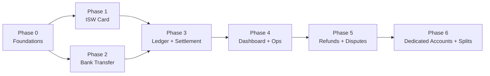
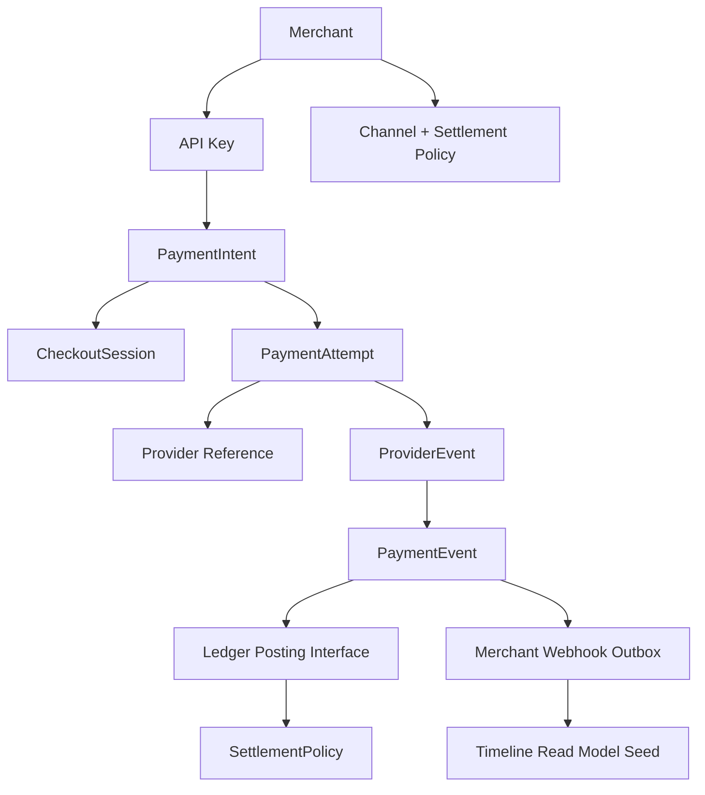
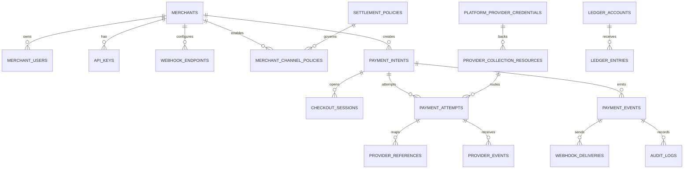
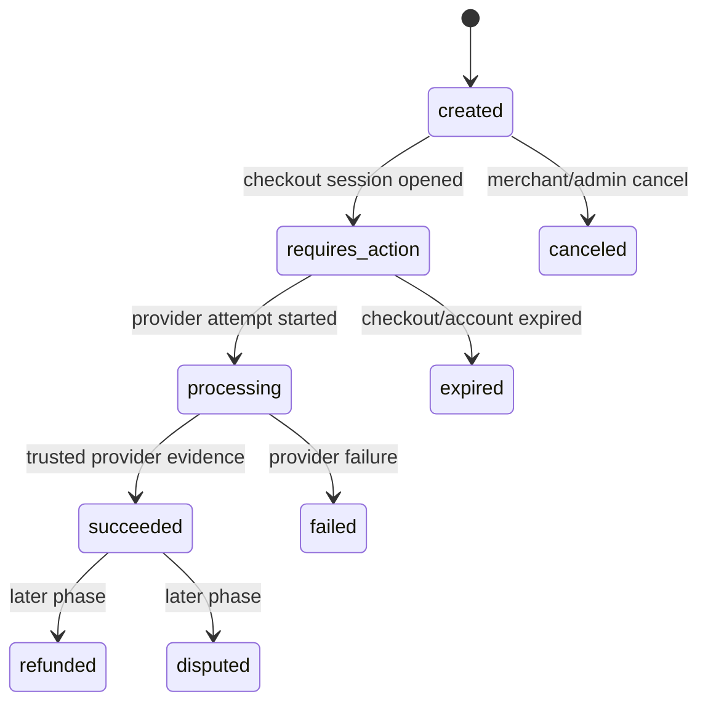
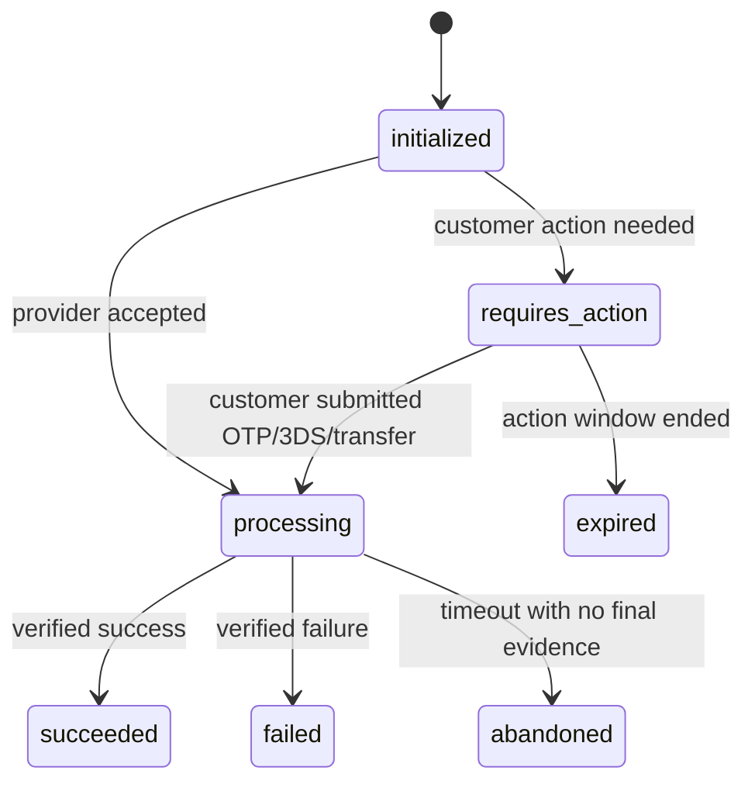
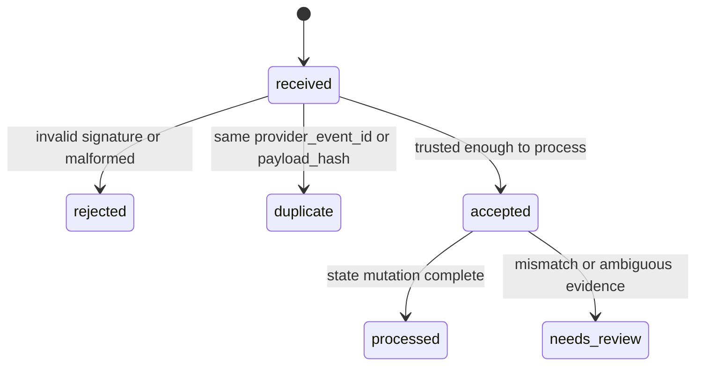
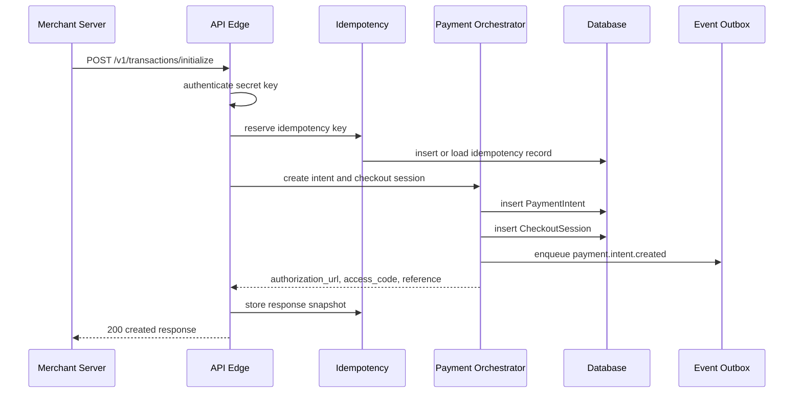
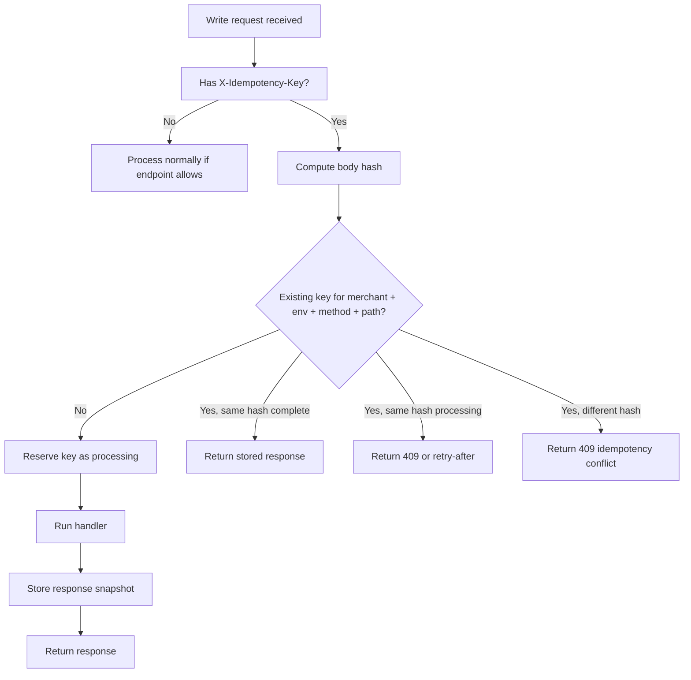
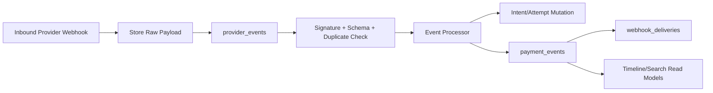
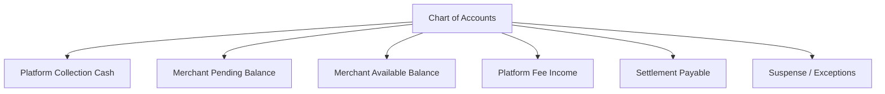

# Phase 0: Foundations

Phase 0 builds the shared spine of the gateway. It does not try to process real payments. It creates the objects, contracts, states, security boundaries, idempotency layer, event spine, provider-adapter shape, and audit model that later phases depend on.

The goal is to make every later rail implementation feel like plugging into a prepared system, not inventing a payment gateway from scratch each time.

## Phase Contract

| Field | Definition |
| --- | --- |
| Primary outcome | A working modular-monolith foundation for merchants, keys, intents, attempts, provider resources, events, ledger scaffolding, settlement policies, audit logs, and adapter contracts. |
| Entry condition | Existing `gateway-baseline` code has been reviewed. Product blueprint decisions are accepted. No live payment traffic is required. |
| Exit condition | In sandbox/test mode, the system can create merchants, API keys, payment intents, checkout sessions, payment attempts, provider credential references, provider events, payment events, ledger accounts, and settlement-policy records without contacting a live provider. |
| Non-goal | No real ISW card charge, no VPS account generation, no settlement payout, no refund automation, no production dashboard. |
| Next phase dependency | Phase 1 can build ISW card collection by using the intent/attempt state machine, provider adapter contract, idempotency layer, event inbox/outbox, and merchant webhook skeleton. Phase 2 can reuse the same for bank transfer. |

## Whole-System Fit



Phase 0 owns the vocabulary of the whole gateway:



## Baseline Inputs To Carry Forward

| Baseline area | Current evidence | Phase 0 interpretation |
| --- | --- | --- |
| Merchant and user setup | `gateway-baseline/src/modules/auth/auth.service.ts`, `gateway-baseline/src/modules/merchant/models/merchant.model.ts`, `gateway-baseline/src/modules/user/user.model.ts` | Keep merchant/user registration as a concept, but strengthen role, status, audit, KYB, and environment boundaries. |
| API keys | `gateway-baseline/src/modules/merchant/models/merchant.keys.model.ts` | Keep public/secret key concept. Add key hashing, environment scope, last-used metadata, restricted scopes later, and safe encryption boundaries. |
| Collection options | `gateway-baseline/src/modules/collection.options/collections.options.service.ts` | Keep merchant channel enablement. Remove merchant-supplied provider credentials from product settings. |
| Transaction model | `gateway-baseline/src/modules/transaction/transaction.model.ts` | Split the single transaction row into PaymentIntent, PaymentAttempt, ProviderEvent, PaymentEvent, and ledger resources. |
| Queues | `gateway-baseline/src/queues/index.ts` | Keep queue-backed async work. Standardize outbox, retries, dead-letter handling, and replayability. |
| Merchant webhooks | `gateway-baseline/src/webhooks/services/commons.ts` | Keep signed webhook delivery. Add timestamp, event id, canonical raw-body signing, delivery logs, and replay controls. |

## Build Slice

Phase 0 should build just enough of each layer to make future phases stable.

| Layer | Build now | Leave for later |
| --- | --- | --- |
| API edge | Versioned routes, auth middleware, request ids, validation, idempotency middleware, response envelope | Full public docs site, SDKs, advanced scopes |
| Merchant core | Merchant profile, users, roles, status, API keys, webhook endpoint records, channel permissions | Full KYB review workflow, advanced team permissions |
| Payment core | PaymentIntent, CheckoutSession, PaymentAttempt, status state machine, basic verify endpoint | Real provider charging, refund states, disputes |
| Provider core | PlatformProviderCredential references, ProviderCollectionResource, adapter interfaces, simulator adapter | Live ISW/VPS/MPGS calls |
| Event core | ProviderEvent inbox, PaymentEvent outbox, replayable processing contract | Complex read-model rebuild tooling |
| Finance core | Ledger account catalog, ledger posting interface, settlement policy records | Full ledger posting, settlement batches, payout reconciliation |
| Operations | Audit logs, structured logs, metrics names, admin-only inspection endpoints | Full dashboard and timeline UI |

## Target Data Model

Phase 0 introduces the canonical write model. Later phases may add fields, but they should not replace these concepts.



### Core Tables

| Table | Purpose | Minimum fields |
| --- | --- | --- |
| `merchants` | Business account collecting payments | `id`, `display_name`, `legal_name`, `status`, `risk_tier`, `default_currency`, `settlement_bank_account_id`, `created_at`, `updated_at` |
| `merchant_users` | Dashboard users and roles | `id`, `merchant_id`, `email`, `name`, `role`, `status`, `last_login_at` |
| `api_keys` | Public/secret keys for API access | `id`, `merchant_id`, `environment`, `type`, `prefix`, `hash`, `encrypted_key_material`, `scopes`, `last_used_at`, `revoked_at` |
| `webhook_endpoints` | Merchant callback destinations | `id`, `merchant_id`, `url`, `status`, `secret_ref`, `event_filter`, `created_at`, `updated_at` |
| `merchant_channel_policies` | Merchant permission to use channels | `id`, `merchant_id`, `channel`, `enabled`, `routing_policy_id`, `settlement_policy_id`, `risk_policy_id` |
| `platform_provider_credentials` | Platform-owned secrets for ISW, VPS, MPGS | `id`, `provider`, `environment`, `status`, `secret_ref`, `version`, `rotated_at` |
| `provider_collection_resources` | Shared provider-side collection resource | `id`, `provider`, `environment`, `credential_id`, `resource_type`, `resource_ref`, `status` |
| `payment_intents` | Merchant request to collect money | `id`, `merchant_id`, `reference`, `amount_minor`, `currency`, `status`, `channels`, `metadata`, `expires_at`, `idempotency_key_id` |
| `checkout_sessions` | Hosted checkout state | `id`, `payment_intent_id`, `access_code`, `status`, `selected_channel`, `callback_url`, `expires_at` |
| `payment_attempts` | One provider/channel attempt | `id`, `payment_intent_id`, `channel`, `provider`, `status`, `amount_minor`, `currency`, `provider_collection_resource_id`, `provider_reference`, `action_required`, `failure_code` |
| `provider_references` | Provider-to-internal mapping | `id`, `provider`, `provider_reference`, `payment_intent_id`, `payment_attempt_id`, `merchant_id`, `environment` |
| `provider_events` | Raw inbound provider evidence | `id`, `provider`, `environment`, `provider_event_id`, `payload_hash`, `raw_payload_ref`, `headers`, `status`, `received_at`, `processed_at` |
| `payment_events` | Gateway-normalized lifecycle event | `id`, `payment_intent_id`, `payment_attempt_id`, `merchant_id`, `event_type`, `payload`, `occurred_at`, `published_at` |
| `webhook_deliveries` | Outbound merchant callback attempts | `id`, `event_id`, `endpoint_id`, `attempt_no`, `status`, `response_code`, `response_body_ref`, `next_retry_at` |
| `idempotency_keys` | Merchant write deduplication | `id`, `merchant_id`, `environment`, `method`, `path`, `key`, `body_hash`, `response_snapshot`, `status`, `expires_at` |
| `ledger_accounts` | Chart of accounts scaffold | `id`, `owner_type`, `owner_id`, `currency`, `account_type`, `name`, `status` |
| `ledger_entries` | Empty or guarded in Phase 0 | `id`, `group_id`, `account_id`, `direction`, `amount_minor`, `currency`, `source_type`, `source_id` |
| `settlement_policies` | Rail-specific settlement availability | `id`, `channel`, `provider`, `currency`, `availability_rule`, `hold_rule`, `status` |
| `audit_logs` | Sensitive operation trail | `id`, `actor_type`, `actor_id`, `merchant_id`, `action`, `target_type`, `target_id`, `metadata`, `created_at` |

## Status Taxonomy

### PaymentIntent



### PaymentAttempt



### ProviderEvent



## Foundation Flow



## API Contract

Phase 0 should stabilize response shape even when provider rails are simulated.

### Authentication

| Key type | Usage | Rule |
| --- | --- | --- |
| Public key | Checkout initialization from client-safe surfaces and pay-link bootstrap | Cannot perform secret operations or list private data. |
| Secret key | Merchant server API calls | Required for initialization, verify, transaction listing, webhook management, refunds later. |
| Admin session/JWT | Internal dashboard and platform operations | Must be role-checked and audit-logged. |

### Required headers

| Header | Required for | Meaning |
| --- | --- | --- |
| `Authorization: Bearer sk_*` | Merchant secret API | Merchant authentication. |
| `X-Idempotency-Key` | Merchant write endpoints | Deduplicates safe retries. |
| `X-Request-Id` | All calls, generated if absent | Correlates logs, events, and support traces. |
| `X-Environment` or key-derived environment | All calls | Separates test and live objects. |

### Initial endpoints

| Endpoint | Purpose | Phase 0 behavior |
| --- | --- | --- |
| `POST /v1/transactions/initialize` | Create PaymentIntent and CheckoutSession | Returns checkout URL/access code; no live provider call. |
| `GET /v1/transactions/:reference/verify` | Fetch authoritative status | Returns intent status and latest attempt if present. |
| `GET /v1/transactions/:reference` | Retrieve payment details | Returns merchant-safe intent, attempt, and metadata. |
| `GET /v1/transactions` | List merchant payments | Basic filters by status, channel, date, reference. |
| `POST /v1/paylinks` | Create pay link backed by PaymentIntent template | Creates inactive or draft pay-link resource if checkout UI is not ready. |
| `POST /v1/webhook-endpoints` | Create/update merchant webhook endpoint | Stores endpoint and secret reference. |
| `POST /v1/webhook-events/:id/replay` | Replay merchant event later | Can be stubbed to validate permission and queue shape. |
| `GET /v1/collection-options` | List merchant-enabled channels | Uses channel policies, not provider credentials. |

### Example initialize response

```json
{
  "status": true,
  "data": {
    "reference": "ref_merchant_order_1001",
    "access_code": "ac_01j...",
    "authorization_url": "https://checkout.example.com/ac_01j...",
    "amount": 150000,
    "currency": "NGN",
    "status": "created",
    "channels": ["card", "bank_transfer"],
    "expires_at": "2026-06-27T13:00:00.000Z"
  }
}
```

## Adapter Interface

Phase 0 should define provider adapters before implementing live providers.

```ts
type Provider = "INTERSWITCH" | "VPS" | "MPGS";
type Channel = "card" | "bank_transfer";

interface ProviderAdapter {
  provider: Provider;
  channel: Channel;
  createAttempt(input: CreateAttemptInput): Promise<CreateAttemptResult>;
  verifyAttempt(input: VerifyAttemptInput): Promise<VerifyAttemptResult>;
  parseWebhook(input: RawProviderWebhook): Promise<ParsedProviderEvent>;
  healthCheck(): Promise<ProviderHealth>;
}
```

Minimum rules:

- Adapters receive credential references, not raw merchant-supplied credentials.
- Adapters return normalized action requirements, not raw provider status as the internal status.
- Adapters must never log raw card data, provider secrets, tokens, or authorization headers.
- Adapters must support sandbox simulators for deterministic tests.

## Idempotency Rules



Rules:

- Idempotency is scoped to merchant, environment, method, path, and key.
- Same key and same body returns the first completed response.
- Same key and different body returns a conflict.
- Processing keys expire or recover through a safe cleanup job.
- Response snapshots must not store secrets or raw PAN/card payloads.

## Event Spine



Phase 0 should implement the shape even if provider events are only simulated.

Minimum event types:

| Event type | Emitted when |
| --- | --- |
| `payment.intent.created` | Merchant initialization succeeds. |
| `payment.checkout.opened` | Checkout session is created or loaded. |
| `payment.attempt.created` | A rail/provider attempt starts. |
| `payment.attempt.requires_action` | OTP, 3DS, transfer, or other payer action is needed. |
| `payment.attempt.processing` | Provider has accepted the attempt but final outcome is pending. |
| `payment.succeeded` | Trusted evidence marks the intent successful. |
| `payment.failed` | Trusted evidence marks the intent failed. |
| `payment.expired` | Checkout or payment window expires. |
| `webhook.delivery.failed` | Merchant webhook attempt fails. |

## Ledger Scaffolding

Phase 0 does not need full financial posting, but it must reserve the structure.



Minimum Phase 0 work:

- Create the ledger account catalog and account types.
- Create merchant account provisioning hooks.
- Create a `LedgerPostingService` interface that can validate a balanced group.
- Allow Phase 1 and Phase 2 to call the interface for minimal pending-balance postings or dry-run postings.
- Defer settlement batch generation, provider statements, and reconciliation until Phase 3.

## Security And Compliance Baseline

| Control | Phase 0 requirement |
| --- | --- |
| Secrets | API keys, provider credential references, webhook secrets, and encryption keys must be separated by purpose. |
| Provider credentials | Stored as platform-owned credential references; merchants cannot submit ISW, VPS, or MPGS credentials. |
| Logs | Redact authorization headers, keys, provider secrets, raw webhook bodies, PAN, CVV, PIN, OTP, and balances. |
| Audit logs | Record API-key creation, webhook endpoint changes, channel policy changes, provider credential changes, and admin actions. |
| Environments | Test and live records cannot share keys, provider resources, attempts, events, balances, or webhooks. |
| PCI posture | Card data handling decisions are documented before Phase 1. Phase 0 only prepares boundaries and log redaction. |

## Implementation Workplan

### 1. Establish Application Boundaries

- Keep a modular monolith structure unless there is a hard operational reason to split services.
- Create modules for `merchant`, `auth`, `keys`, `checkout`, `payments`, `providers`, `events`, `ledger`, `settlements`, `webhooks`, `audit`, and `observability`.
- Use shared request context with `request_id`, `merchant_id`, `environment`, `actor`, and `idempotency_key`.
- Add typed error codes and stable response envelopes.

### 2. Build Merchant And Key Foundations

- Normalize merchant status: `pending`, `active`, `suspended`, `closed`, `requires_review`.
- Normalize user roles: `owner`, `admin`, `developer`, `support`, `finance`, platform roles later.
- Generate public and secret keys per environment.
- Hash keys for lookup. Encrypt key material only when the UI needs one-time display.
- Track `last_used_at`, `last_used_ip`, and `revoked_at`.

### 3. Replace Collection Options With Channel Policies

- Model merchant channel enablement separately from provider credentials.
- Add channel values: `card`, `bank_transfer`.
- Add provider routing values: `INTERSWITCH`, `VPS`, `MPGS`.
- Add default settlement policies: local card T+1, bank transfer T+1, MPGS international card up to T+7.
- Reject any API payload that tries to submit provider MID, password, client secret, webhook secret, or terminal credentials as merchant settings.

### 4. Build Payment Intent And Checkout Session

- Create `PaymentIntent` from merchant initialize call.
- Enforce unique merchant reference per merchant/environment.
- Store amount as `amount_minor` in kobo.
- Store currency, customer, metadata, callback URL, channels, and expiry.
- Create a `CheckoutSession` with access code and hosted-checkout URL.
- Return stable initialize response.

### 5. Build Payment Attempt Skeleton

- Add attempt creation API or internal service for selected channel.
- Allow simulator provider attempts only.
- Normalize statuses and action requirements.
- Store provider reference mappings if simulator returns them.
- Prevent more than one active attempt per channel unless explicitly configured.

### 6. Build Event Inbox And Outbox

- Persist inbound provider events before processing.
- Deduplicate by provider event id when available, otherwise payload hash.
- Emit payment events after state changes.
- Store outbound merchant webhook delivery records even if actual delivery worker is stubbed.
- Include raw-body preservation strategy for real webhooks in Phase 1 and Phase 2.

### 7. Add Audit And Observability

- Record audit logs for sensitive changes.
- Add structured logs for request id, merchant id, intent id, attempt id, provider, and event id.
- Define metrics names before dashboards exist.
- Add health endpoints for database, Redis/queue, and provider adapter registry.

## Testing Requirements

| Area | Test |
| --- | --- |
| Money | Initialize with NGN amount stores `amount_minor` as integer kobo. |
| Reference uniqueness | Same merchant/reference cannot create two active intents. |
| Idempotency | Same key/body returns same response; same key/different body returns conflict. |
| Auth | Secret key can initialize; public key cannot list private transactions. |
| Environment | Test key cannot access live records and live key cannot access test records. |
| Provider credentials | Merchant settings reject raw provider credentials. |
| Events | Duplicate provider event id or payload hash is marked duplicate. |
| Webhook outbox | Payment event creates delivery records for active endpoints. |
| Ledger scaffold | Posting interface rejects unbalanced groups. |
| Audit | Key creation and webhook endpoint updates create audit logs. |

## Exit Criteria

Phase 0 is complete when:

- Migrations create the core tables without destructive changes to unrelated baseline data.
- Merchant registration, login, key creation, and key authentication work in test mode.
- `POST /v1/transactions/initialize` creates a PaymentIntent and CheckoutSession.
- Replaying initialize with the same idempotency key returns the same response.
- PaymentIntent and PaymentAttempt state transitions are enforced through services, not ad hoc updates.
- Provider adapter interfaces exist with at least one simulator implementation.
- ProviderEvent inbox and PaymentEvent outbox records can be created and replayed in test mode.
- Merchant webhook endpoints can be stored with secret references.
- Ledger account scaffolding and settlement policies exist.
- Audit logs are created for sensitive administrative changes.
- A developer can run tests for the above without real ISW, VPS, or MPGS access.

## Handoff To Phase 1

Phase 1 can assume:

- Merchant API keys and environment scoping work.
- `PaymentIntent`, `CheckoutSession`, and `PaymentAttempt` exist.
- Channel availability can answer whether a merchant can use `card`.
- A provider adapter can create and verify attempts.
- Provider events can be persisted before processing.
- Payment events can trigger merchant webhook deliveries.
- Ledger posting interface exists, even if only minimal pending-balance posting is enabled.

Phase 1 must not bypass these foundations. Interswitch-specific fields belong in attempt provider data or provider references, not back in a single transaction row.
