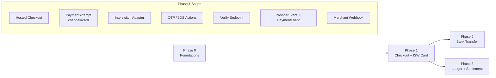
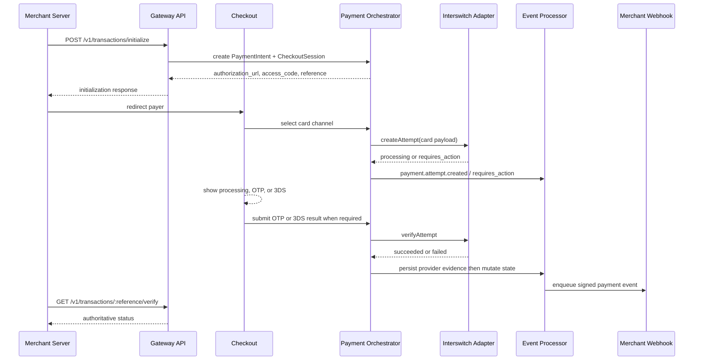
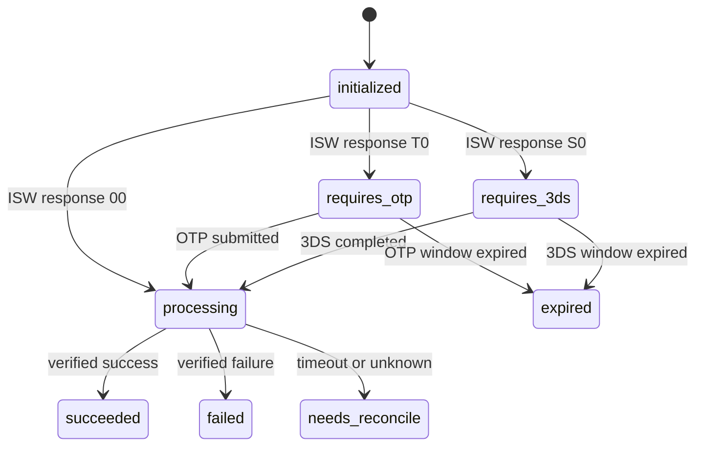
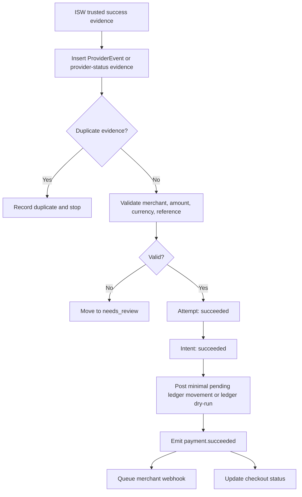

# Phase 1: Checkout And ISW Card

Phase 1 turns the foundation into the first real collection rail: hosted checkout plus Nigerian/local card collection through Interswitch. This phase proves that a merchant can initialize a payment, send the payer through checkout, complete card authentication, verify the outcome, and receive a signed merchant webhook.

The phase should build enough ledger and settlement hooks to mark successful local-card funds as pending and T+1 eligible later, but it should not build full settlement operations. Full balances, batches, and reconciliation are Phase 3.

## Phase Contract

| Field | Definition |
| --- | --- |
| Primary outcome | End-to-end sandbox ISW card payment through hosted checkout, with OTP/3DS action handling, provider-event persistence, verify endpoint, normalized statuses, and merchant webhook delivery. |
| Entry condition | Phase 0 is complete: intents, attempts, checkout sessions, idempotency, provider adapter interfaces, event inbox/outbox, webhook endpoints, and ledger scaffold exist. |
| Exit condition | A sandbox local-card payment can succeed exactly once, duplicate provider evidence is safe, merchant receives a signed `payment.succeeded` event, and local-card funds are represented as pending until T+1 eligibility. |
| Non-goal | Full settlement batching, refunds, chargebacks, MPGS international card launch, saved cards, recurring billing, or broad provider routing. |
| Next phase dependency | Phase 2 can reuse checkout, attempt creation, provider event processing, merchant webhooks, and support timeline conventions for bank transfer. |

## Whole-System Fit



## Product Slice

Phase 1 should let a merchant do this:

1. Merchant server calls `POST /v1/transactions/initialize`.
2. Merchant redirects payer to hosted checkout.
3. Payer selects card.
4. Gateway initiates local-card payment through Interswitch.
5. Payer completes required OTP or Visa 3DS action when needed.
6. Gateway verifies the provider outcome.
7. Gateway marks the payment succeeded or failed.
8. Gateway emits `payment.succeeded` or `payment.failed`.
9. Merchant receives signed webhook and can verify by reference.

## Baseline Inputs To Carry Forward

| Baseline area | Current evidence | Phase 1 interpretation |
| --- | --- | --- |
| Interswitch token caching | `gateway-baseline/src/modules/isw/isw.service.ts` caches an ISW auth token in Redis | Keep token caching, but move it into the Interswitch adapter and include credential versioning and health state. |
| ISW response-code handling | Baseline maps `00`, `T0`, and `S0` to processing, OTP, and Visa 3DS flows | Keep the mapping, but normalize it into internal action/status values. |
| Card validation | `gateway-baseline/src/modules/isw/isw.card.validator.ts` validates scheme | Keep scheme detection where useful, but never store PAN or sensitive card data. |
| Socket updates | Baseline triggers Pusher channels for card status | Keep real-time checkout updates as optional UX. Payment truth remains server verification and event processing. |
| Transaction row | Baseline stores local-card status and card metadata on `transactions` | Replace with PaymentAttempt provider data and safe card metadata. |
| Merchant webhook | Baseline queues merchant inflow webhook after success | Keep queue-backed delivery and add event id, timestamp, delivery logs, and replay. |

## Card Architecture Decision

The card-entry path is a security boundary, not only a product flow.

| Topic | Phase 1 rule |
| --- | --- |
| Raw card data | Do not persist PAN, CVV, PIN, expiry, OTP, or generated authData. |
| Logging | Redact card inputs, authData, tokens, authorization headers, and provider secrets. |
| PCI scope | If direct card data touches gateway servers, treat the card module as PCI-scoped. If provider-hosted fields are available and approved, prefer them. |
| Browser callback | Treat as a UX hint only. Never mark paid from browser return alone. |
| Stored card metadata | Last4, scheme, issuer/BIN-derived non-sensitive metadata only after provider verification. |

## Target Objects

| Object | Owned/extended in this phase | Notes |
| --- | --- | --- |
| `checkout_sessions` | Extend with selected channel, browser status, and action state | Used by hosted checkout UI. |
| `payment_attempts` | Add card attempt states and action requirements | `channel=card`, `provider=INTERSWITCH`. |
| `payment_attempt_provider_data` | Store ISW payment id, transaction id, response code, safe metadata | Keep raw provider payload in controlled evidence storage or redacted JSON. |
| `provider_references` | Map ISW `paymentId` and merchant reference to attempt | Required for status checks and webhooks. |
| `provider_events` | Persist ISW status responses/webhooks before mutation | Some provider evidence may come from polling rather than webhook. |
| `payment_events` | Emit normalized payment events | Used by webhooks, timeline, and later dashboard. |
| `webhook_deliveries` | Send signed merchant events | Reuses Phase 0 outbox. |
| `ledger_entries` | Optional minimal pending-balance posting through ledger facade | Full settlement is Phase 3. |

## Interswitch Adapter Contract

```ts
interface InterswitchCardAdapter {
  createAttempt(input: CardAttemptInput): Promise<CardAttemptResult>;
  submitOtp(input: OtpSubmissionInput): Promise<CardAttemptResult>;
  submitThreeDS(input: ThreeDSSubmissionInput): Promise<CardAttemptResult>;
  verifyAttempt(input: VerifyAttemptInput): Promise<CardVerificationResult>;
  parseWebhook(input: RawProviderWebhook): Promise<ParsedProviderEvent>;
  healthCheck(): Promise<ProviderHealth>;
}
```

### Response Normalization

| ISW signal | Internal attempt status | Internal action | Meaning |
| --- | --- | --- | --- |
| `00` at initiation | `processing` | `none` | Provider accepted; poll/verify for final state. |
| `T0` | `requires_action` | `otp` | Payer must submit OTP. |
| `S0` | `requires_action` | `three_ds` | Payer must complete Visa 3DS challenge. |
| final success from status check | `succeeded` | `none` | Trusted provider evidence says paid. |
| final failure from status check | `failed` | `none` | Provider declined or failed. |
| timeout/unknown | `processing` or `abandoned` by policy | `status_check` | Reconciliation should recover later. |

## Core Checkout Flow



## Action Handling



## API Contract

### Merchant-facing

| Endpoint | Purpose | Notes |
| --- | --- | --- |
| `POST /v1/transactions/initialize` | Create intent and checkout session | From Phase 0, now card can be selected. |
| `GET /v1/transactions/:reference/verify` | Authoritative status | Must consult internal state and refresh provider status when safe. |
| `GET /v1/transactions/:reference` | Retrieve transaction details | Include safe card metadata only after verification. |

### Checkout-facing

| Endpoint | Purpose | Notes |
| --- | --- | --- |
| `GET /v1/checkout/:access_code` | Load checkout session | Public access code, no merchant secret. |
| `POST /v1/checkout/:access_code/card/attempts` | Start card payment attempt | Must create or reuse attempt safely. |
| `POST /v1/checkout/:access_code/card/actions/otp` | Submit OTP | Never store OTP. |
| `POST /v1/checkout/:access_code/card/actions/three-ds` | Submit 3DS data or completion signal | Do not trust browser completion without provider verification. |
| `GET /v1/checkout/:access_code/status` | Poll checkout status | Returns intent/attempt status and required action. |

### Provider-facing

| Endpoint | Purpose | Notes |
| --- | --- | --- |
| `POST /v1/provider-webhooks/interswitch` | Ingest ISW provider callbacks if available | Raw-body capture, signature validation, provider_event insert before mutation. |

## Merchant Webhook Contract

Phase 1 should deliver at least:

| Event | Required fields |
| --- | --- |
| `payment.succeeded` | `event_id`, `event_type`, `created_at`, `merchant_id`, `reference`, `amount`, `currency`, `channel`, `provider`, `status`, `paid_at`, `fees`, `customer`, `authorization`, `metadata` |
| `payment.failed` | `event_id`, `event_type`, `created_at`, `reference`, `amount`, `currency`, `channel`, `provider`, `status`, `failure_code`, `failure_message`, `metadata` |

Required headers:

| Header | Meaning |
| --- | --- |
| `X-Gateway-Signature` | HMAC over timestamp, event id, and exact raw JSON body. |
| `X-Gateway-Timestamp` | Unix timestamp or ISO timestamp for replay protection. |
| `X-Gateway-Event-Id` | Stable event id for merchant dedupe. |

## Data Flow For Success



## Implementation Workplan

### 1. Hosted Checkout Shell

- Create checkout session loading by access code.
- Show merchant name, amount, currency, reference, and available channels.
- Implement card channel selection.
- Add status polling or real-time updates.
- Add expiry handling and clear terminal states.

### 2. Interswitch Adapter

- Move ISW token acquisition and caching behind adapter interface.
- Resolve platform-owned ISW credential by environment and collection resource.
- Implement create attempt, OTP submit, 3DS submit, and status check.
- Normalize ISW responses into internal statuses and actions.
- Add bounded timeouts and provider health metrics.
- Add simulator mode for success, failure, OTP, 3DS, timeout, duplicate evidence, and signature failure paths.

### 3. Payment Orchestration

- Create card PaymentAttempt when payer selects card.
- Prevent duplicate active attempts for the same checkout unless retry policy allows it.
- Bind attempt to PaymentIntent, merchant, provider collection resource, amount, and currency.
- Store safe provider references.
- Move state using a state machine service only.

### 4. Action UX And API

- Return action payloads needed by checkout without exposing secrets.
- Handle OTP submission.
- Handle 3DS challenge result or browser return.
- Re-verify with provider before terminal success.
- Expire action windows cleanly.

### 5. Provider Event Processing

- Persist status-check results and inbound webhooks as provider evidence.
- Deduplicate by provider event id or payload hash.
- Validate amount, currency, merchant reference, attempt id, and provider reference.
- Emit normalized payment events only after validation.

### 6. Merchant Webhook Delivery

- Use Phase 0 webhook outbox.
- Sign the raw JSON event with timestamp and event id.
- Retry failed delivery with exponential backoff.
- Record response code and response body reference.
- Expose replay hooks for Phase 4 dashboard.

### 7. Minimal Financial Hook

- On success, call ledger facade with a balanced pending-balance posting or a dry-run posting record.
- Store `settlement_available_at` according to local-card T+1 policy.
- Do not generate settlement batches yet.
- Do not make funds available before Phase 3 reconciliation rules are active.

## Observability

| Metric | Why it matters |
| --- | --- |
| `payments.card.attempts_total` | Tracks card usage. |
| `payments.card.success_rate` | Reveals provider or checkout problems. |
| `payments.card.requires_action_rate` | Measures OTP/3DS frequency. |
| `payments.card.processing_age_seconds` | Detects stuck payments. |
| `providers.isw.latency_ms` | Watches provider health. |
| `providers.isw.error_code_total` | Groups provider failures. |
| `webhooks.merchant.delivery_success_rate` | Confirms merchant fulfillment reliability. |
| `provider_events.duplicate_total` | Confirms duplicate evidence is being handled. |

## Test Matrix

| Area | Test | Expected result |
| --- | --- | --- |
| Initialization | Merchant initializes card-enabled payment | PaymentIntent and CheckoutSession created. |
| Card success | ISW simulator returns final success | Attempt and intent become `succeeded`; webhook queued once. |
| OTP | ISW returns `T0`, payer submits valid OTP | `requires_action` to `processing` to `succeeded`. |
| 3DS | ISW returns `S0`, payer completes challenge | `requires_action` to `processing`; final state requires provider verification. |
| Decline | Provider returns failure | Attempt and intent become `failed`; failure event emitted. |
| Duplicate evidence | Same provider success arrives twice | One state mutation, one ledger posting, one payment event. |
| Amount mismatch | Provider evidence amount differs | Event goes to `needs_review`; no success webhook. |
| Currency mismatch | Provider evidence currency differs | Event goes to `needs_review`; no success webhook. |
| Replay initialize | Same idempotency key/body | Same response, no duplicate intent. |
| PCI/logging | Card data submitted | No PAN, CVV, PIN, OTP, authData, or token appears in logs or persisted JSON. |
| Verify | Merchant verifies after success | Authoritative success with safe card metadata. |
| Webhook failure | Merchant endpoint returns 500 | Retry scheduled and delivery visible. |

## Exit Criteria

Phase 1 is complete when:

- Hosted checkout can load a Phase 0 checkout session.
- Card channel can be selected only for merchants with card enabled.
- Interswitch adapter supports simulator and sandbox mode.
- ISW `00`, `T0`, and `S0` paths map to internal processing, OTP, and 3DS states.
- No sensitive card data is persisted or logged.
- Provider success evidence is persisted before state mutation.
- Duplicate provider evidence cannot double-complete a payment.
- `GET /v1/transactions/:reference/verify` returns authoritative card status.
- Merchant receives a signed `payment.succeeded` webhook after verified success.
- Successful local-card payment records settlement availability as T+1 pending, without creating a payout batch.
- Card-flow tests run without live provider dependencies.

## Handoff To Phase 2

Phase 2 can assume:

- Checkout session lifecycle works.
- PaymentAttempt can model `requires_action`, `processing`, `succeeded`, `failed`, and `expired`.
- Provider evidence can be persisted, deduped, validated, and processed.
- Merchant webhooks can be emitted from payment events.
- Verify endpoint can report authoritative state.
- The timeline can be reconstructed from intent, attempt, provider event, and payment event records.

Phase 2 should reuse these exact lifecycle and event contracts for bank transfer. A virtual account is just another action requirement from the payer: transfer the exact amount to the assigned account before expiry.
