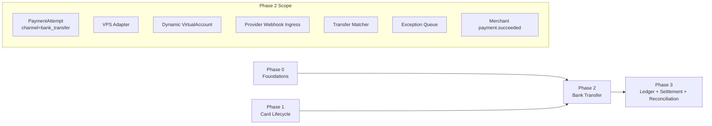
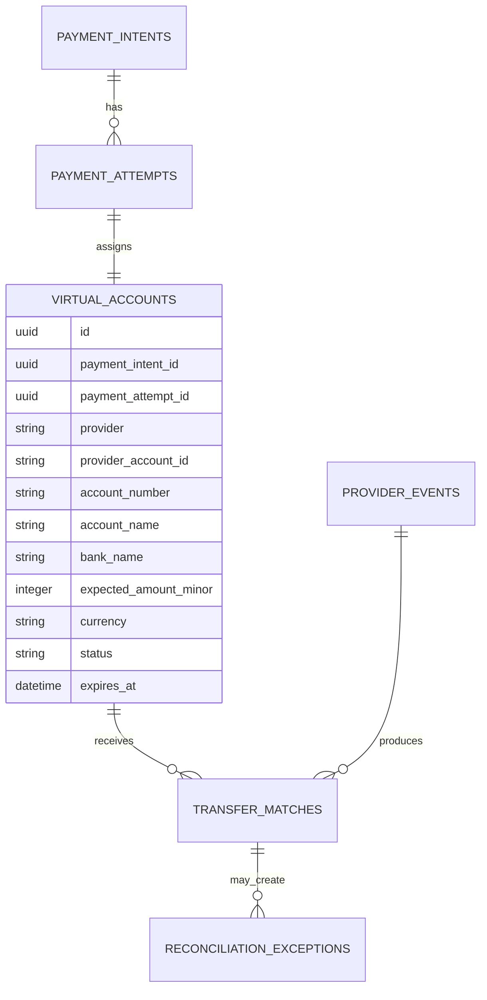
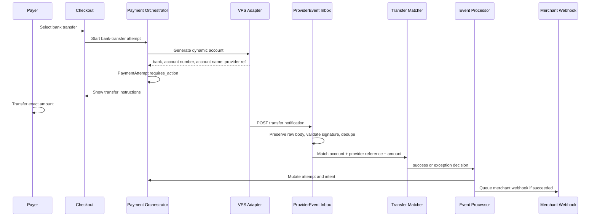
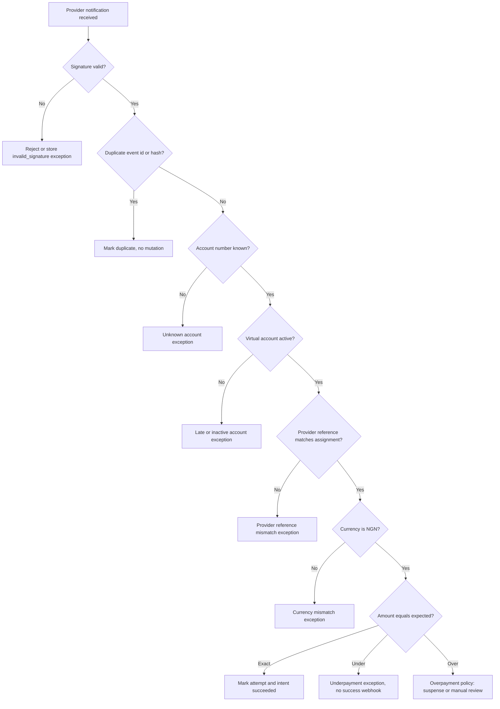
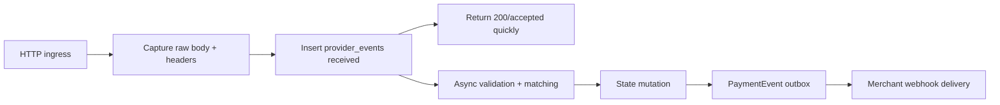

# Phase 2: Bank Transfer

Phase 2 adds bank transfer collection through dynamic virtual accounts. It reuses the Phase 0 and Phase 1 payment lifecycle, but swaps the payer action from card authentication to "transfer the exact NGN amount to this generated account before expiry."

The outcome is a transfer rail that can safely match provider notifications to the correct merchant and PaymentIntent under platform-owned VPS credentials.

## Phase Contract

| Field | Definition |
| --- | --- |
| Primary outcome | Dynamic virtual-account bank transfer checkout with VPS provider adapter, provider webhook ingestion, exact-transfer matching, duplicate protection, exception handling, and merchant webhook delivery. |
| Entry condition | Phase 0 foundations exist. Phase 1 lifecycle patterns for checkout, attempts, provider events, verify, and merchant webhooks are available or equivalent. |
| Exit condition | A sandbox transfer to a generated account succeeds exactly once, duplicate/under/over/late transfers are handled by policy, and transfer funds remain pending until T+1 eligibility. |
| Non-goal | Dedicated customer accounts, splits, full settlement batching, automated bank payout, refund automation, open banking, or multi-provider virtual-account routing. |
| Next phase dependency | Phase 3 can rely on successful transfer events and exceptions to build balances, settlement batches, and reconciliation. |

## Whole-System Fit



## Product Slice

Phase 2 should let a merchant do this:

1. Merchant initializes a payment with `bank_transfer` available.
2. Payer opens checkout and selects bank transfer.
3. Gateway requests a dynamic virtual account from the VPS adapter.
4. Gateway returns bank name, account number, account name, amount, reference, and expiry.
5. Payer transfers the exact amount.
6. Provider sends transfer notification.
7. Gateway validates signature and inserts ProviderEvent.
8. Gateway matches the event to VirtualAccount and PaymentIntent.
9. Gateway marks payment succeeded or creates an exception.
10. Merchant can verify by reference and receives signed webhook on success.

## Baseline Inputs To Carry Forward

| Baseline area | Current evidence | Phase 2 interpretation |
| --- | --- | --- |
| Account generation | `gateway-baseline/src/modules/transfer/transfer.service.ts` requests a VPS dynamic account | Keep dynamic account generation but bind account to PaymentIntent, amount, expiry, provider resource, and environment. |
| VPS service | `gateway-baseline/src/services/vps/vps.service.ts` and DTOs | Move provider calls behind a VPS adapter with platform-owned credential references. |
| Webhook matching | `gateway-baseline/src/webhooks/services/vps.ts` matches `providerReference` and `accountNumber` | Keep those checks, add provider event id/payload hash, account expiry, amount/currency policy, and collection-resource checks. |
| Amount checking | Baseline can reject mismatched amounts | Keep strict exact-match as launch default. Route under/overpayment to exceptions. |
| Pay links | Baseline marks pay links `USED` on success | Continue through PaymentIntent and PaymentEvent, not direct transaction mutation. |
| Merchant webhook queue | Baseline dispatches success webhook | Reuse signed Phase 1 merchant webhook contract. |

## Target Objects

| Object | Owned/extended in this phase | Notes |
| --- | --- | --- |
| `virtual_accounts` | Dynamic account assignment for checkout | `account_type=dynamic`, amount-bound, expiry-bound. |
| `payment_attempts` | Transfer attempt with `requires_action` until credit arrives | `channel=bank_transfer`, `provider=VPS`. |
| `payment_attempt_provider_data` | VPS initiation reference, provider account id, bank details | No provider secrets. |
| `provider_events` | VPS transfer notifications | Raw body persisted before validation result. |
| `transfer_matches` | Optional table for event-to-account matching decisions | Useful for audit and exception review. |
| `reconciliation_exceptions` | Underpayment, overpayment, late payment, unknown account, duplicate, invalid signature | Phase 3 will mature exception workflows. |
| `payment_events` | Normalized success/failure/exception events | Feeds merchant webhooks and timeline. |

## Dynamic Virtual Account Model



Minimum virtual-account fields:

| Field | Rule |
| --- | --- |
| `payment_intent_id` | Required. The account exists to satisfy one intent. |
| `payment_attempt_id` | Required. The account is the action for a bank-transfer attempt. |
| `provider_collection_resource_id` | Required. Identifies shared platform resource used for attribution. |
| `account_number` | Unique while active for provider/resource. |
| `expected_amount_minor` | Required. Store in kobo. |
| `currency` | Must be `NGN` for launch. |
| `expires_at` | Required. Late payments become exceptions. |
| `status` | `assigned`, `credited`, `expired`, `released`, `suspended`. |

## Transfer Flow



## Matching Decision Tree



## Matching Policy

| Scenario | Launch behavior | Merchant-visible status |
| --- | --- | --- |
| Exact amount before expiry | Mark succeeded, emit webhook, pending settlement T+1 | `succeeded` |
| Duplicate notification | Record duplicate, no second event, no second ledger post | unchanged |
| Invalid signature | Reject or store invalid event, no state mutation | unchanged |
| Unknown account number | Create exception for ops review | unchanged or `processing` |
| Known account but wrong provider reference | Create exception | unchanged |
| Underpayment | Create exception; do not fulfill merchant order | `processing` or `requires_review` |
| Overpayment | Apply configured policy: expected amount plus suspense, or full manual review | `processing` or `requires_review` |
| Late payment after expiry | Create late-payment exception | `expired` or `requires_review` |
| Provider sends success but amount/currency mismatch | Create exception; no success webhook | `requires_review` |

## API Contract

### Checkout-facing

| Endpoint | Purpose | Notes |
| --- | --- | --- |
| `POST /v1/checkout/:access_code/bank-transfer/attempts` | Generate or load dynamic account | Idempotent per checkout session and active attempt. |
| `GET /v1/checkout/:access_code/status` | Poll payment status | Returns transfer instructions while `requires_action`. |

### Merchant-facing

| Endpoint | Purpose | Notes |
| --- | --- | --- |
| `GET /v1/transactions/:reference/verify` | Authoritative status | Must report transfer success only after trusted provider evidence or reconciliation. |
| `GET /v1/transactions/:reference` | Payment details | Include safe account assignment and timeline. |

### Provider-facing

| Endpoint | Purpose | Notes |
| --- | --- | --- |
| `POST /v1/provider-webhooks/vps` | Ingest VPS transfer notifications | Raw-body capture, signature validation, provider_event insert, then async processing. |

## Example Checkout Response

```json
{
  "status": true,
  "data": {
    "reference": "ref_merchant_order_1001",
    "channel": "bank_transfer",
    "amount": 150000,
    "currency": "NGN",
    "bank_name": "Providus Bank",
    "account_number": "1234567890",
    "account_name": "MALIMBE / ACME STORES",
    "expires_at": "2026-06-27T13:00:00.000Z",
    "status": "requires_action"
  }
}
```

## Provider Webhook Processing

Provider webhooks should acknowledge quickly after raw persistence. Business processing can be asynchronous.



Important rules:

- Never perform long provider reconciliation before acknowledging webhook receipt.
- Invalid signatures should not mutate payment state.
- Duplicate events should be acknowledged without repeated processing.
- Store enough evidence for support to explain the decision.

## Implementation Workplan

### 1. VPS Adapter

- Resolve the active platform-owned VPS credential by environment.
- Implement dynamic account generation.
- Implement webhook signature verification.
- Normalize provider fields into internal event fields.
- Add provider health check and error metrics.
- Add simulator events for exact, duplicate, under, over, late, invalid signature, and unknown account.

### 2. Virtual Account Assignment

- Add `virtual_accounts` table and service.
- Generate one active account per bank-transfer attempt.
- Bind the account to amount, currency, merchant, provider resource, and expiry.
- Prevent reusing an active account outside its assignment window.
- Expire stale accounts with a scheduled job.

### 3. Transfer Attempt Orchestration

- When payer selects bank transfer, create `PaymentAttempt(channel=bank_transfer, provider=VPS)`.
- Call VPS adapter for account generation.
- Move attempt to `requires_action`.
- Return transfer instructions to checkout.
- Allow safe idempotent reloading of the same active assignment.

### 4. Provider Event Ingestion

- Add VPS webhook route with raw-body access.
- Insert ProviderEvent before processing.
- Validate signature using platform credential reference.
- Deduplicate by provider event id or payload hash.
- Put invalid or ambiguous events into exception records.

### 5. Transfer Matching

- Match by account number, provider initiation reference, merchant/internal reference when available, and provider collection resource.
- Validate amount and currency.
- Validate account active window.
- Validate intent and attempt are in a payable state.
- Mark exact payments succeeded.
- Send mismatch cases to exceptions.

### 6. Success Processing

- Mark PaymentAttempt succeeded.
- Mark PaymentIntent succeeded.
- Emit `payment.succeeded`.
- Call ledger facade for pending transfer posting or dry run.
- Set `settlement_available_at` using T+1 policy.
- Queue signed merchant webhook.
- Update checkout status.

### 7. Exception Handling

- Create `reconciliation_exceptions` for ambiguous events.
- Include enough context: provider event id, account number, expected amount, received amount, expiry, provider refs, merchant, intent, attempt.
- Provide admin-only list/detail endpoints for Phase 4 UI.
- Do not silently adjust merchant balances.

## Observability

| Metric | Why it matters |
| --- | --- |
| `payments.transfer.accounts_generated_total` | Tracks account assignment volume. |
| `payments.transfer.account_generation_failed_total` | Reveals provider or credential issues. |
| `payments.transfer.success_rate` | Measures transfer completion. |
| `payments.transfer.notification_lag_seconds` | Measures delay between assignment and provider credit. |
| `payments.transfer.exceptions_total` | Measures under/over/unknown/late cases. |
| `providers.vps.webhook_signature_failures_total` | Detects attack, drift, or credential issue. |
| `provider_events.duplicates_total` | Confirms idempotent ingestion. |
| `virtual_accounts.expired_total` | Tracks payer abandonment or provider delays. |

## Test Matrix

| Area | Test | Expected result |
| --- | --- | --- |
| Account generation | Payer selects bank transfer | Dynamic virtual account assigned and attempt becomes `requires_action`. |
| Idempotent reload | Same checkout requests transfer account again | Same active assignment returned, no duplicate attempt. |
| Exact payment | Provider sends exact amount before expiry | Intent succeeded, event emitted, webhook queued once. |
| Duplicate webhook | Same provider event arrives twice | Duplicate recorded, no second mutation. |
| Invalid signature | Webhook signature fails | No state mutation, event rejected or exceptioned. |
| Underpayment | Received amount lower than expected | Exception created, no success webhook. |
| Overpayment | Received amount higher than expected | Exception or suspense policy applied, no silent over-credit. |
| Unknown account | Notification account is not assigned | Exception created. |
| Late payment | Transfer arrives after expiry | Late-payment exception created. |
| Verify | Merchant verifies successful transfer | Authoritative success only after trusted matching. |
| Expiry job | Account expires with no transfer | Attempt and/or intent becomes expired according to policy. |

## Exit Criteria

Phase 2 is complete when:

- Bank transfer can be selected in checkout only for enabled merchants.
- VPS adapter supports simulator and sandbox mode.
- Dynamic virtual accounts are bound to intent, attempt, amount, currency, provider resource, and expiry.
- VPS webhook route persists raw provider evidence before processing.
- Exact transfer success mutates state once and emits one `payment.succeeded`.
- Duplicate, invalid, under, over, unknown, and late transfer cases are visible as exceptions or duplicates.
- Merchant verify endpoint returns transfer status and safe bank/account evidence.
- Successful transfer records settlement availability as T+1 pending.
- Transfer tests run without live provider dependencies.

## Handoff To Phase 3

Phase 3 can assume:

- Card and transfer rails emit normalized payment events.
- Successful payments have amount, currency, merchant, channel, provider, attempt, and settlement availability data.
- Provider events are persisted and deduplicated.
- Transfer exceptions exist for reconciliation workflows.
- Merchant webhooks are not the source of financial truth.

Phase 3 must turn these successful payment events and exceptions into rigorous ledger entries, balances, settlement batches, and provider reconciliation outcomes.
