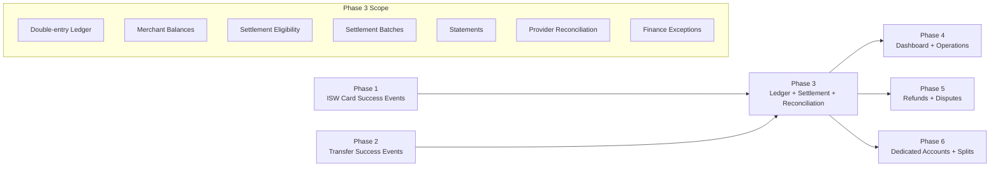
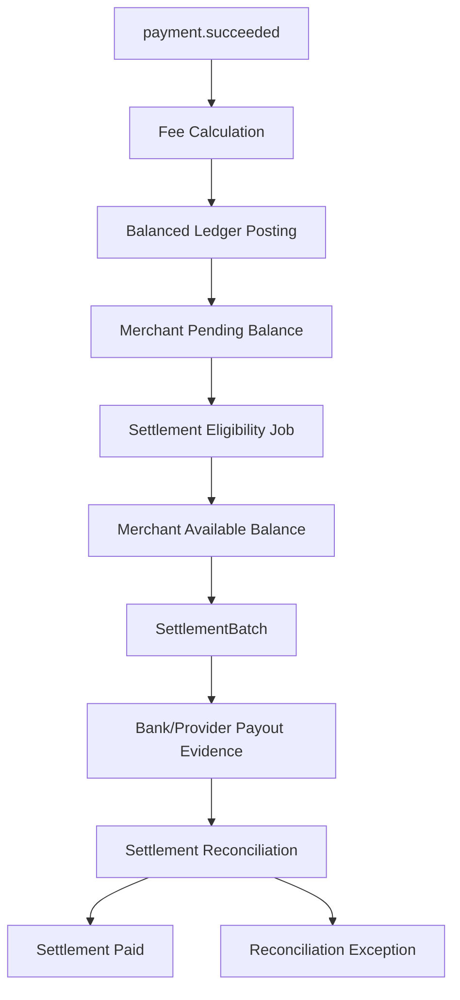
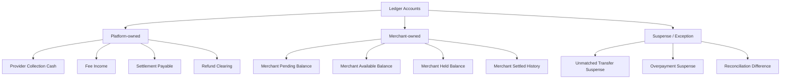
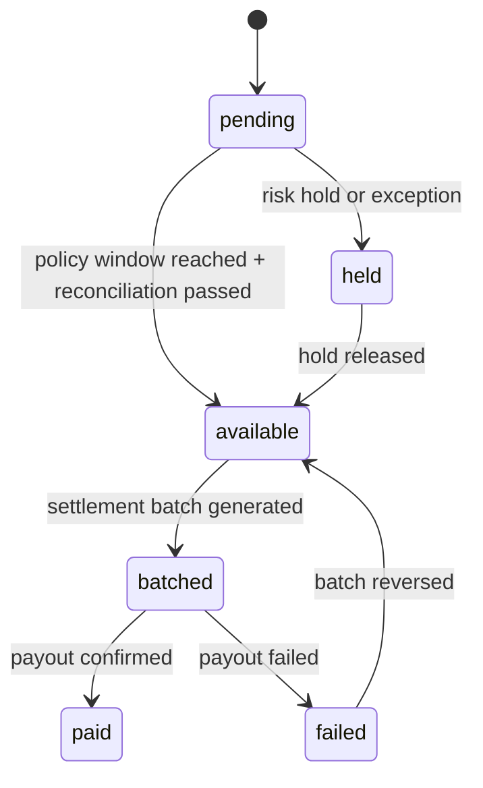
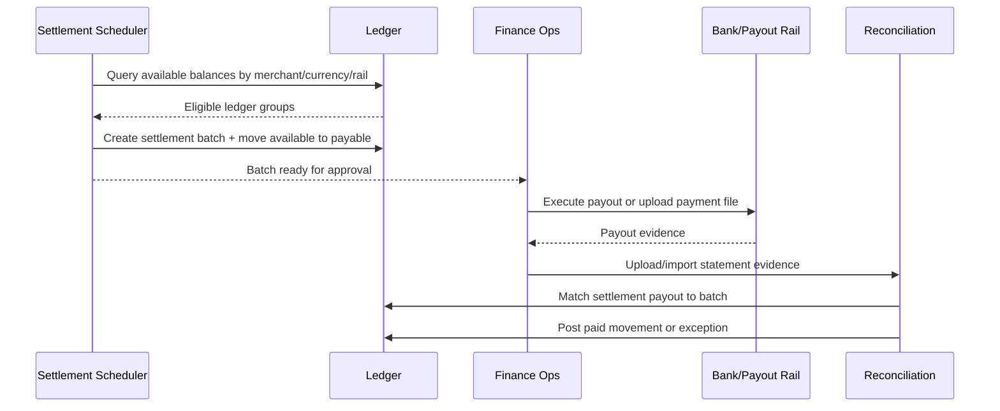
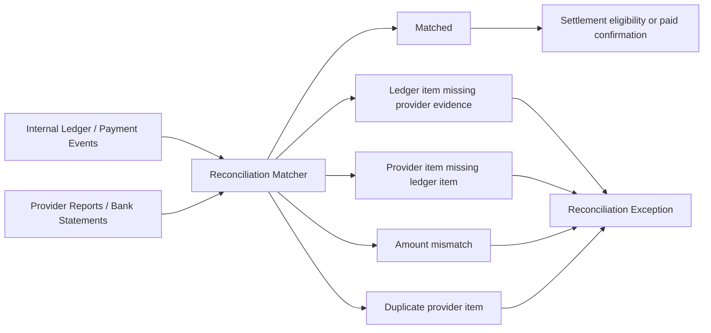

# Phase 3: Ledger, Settlement, And Reconciliation

Phase 3 makes the gateway financially trustworthy. Phases 1 and 2 prove that payments can succeed through card and transfer rails. Phase 3 turns those successful payment events into double-entry ledger postings, merchant balances, settlement batches, statements, and reconciliation workflows.

The phase goal is simple: no merchant balance, settlement amount, refund eligibility, or finance report should depend on a provider payload or transaction status alone. The ledger is the financial source of truth.

## Phase Contract

| Field | Definition |
| --- | --- |
| Primary outcome | Double-entry ledger, merchant balances, rail-specific settlement eligibility, settlement batch generation, statements, provider reconciliation, and exception handling. |
| Entry condition | Card and bank-transfer phases emit normalized successful payment events and record provider evidence. Phase 0 ledger scaffold exists. |
| Exit condition | Every successful payment posts balanced entries; balances reconcile by merchant/currency/rail; settlement batches can be generated and reconciled; provider mismatches create exceptions instead of silent adjustments. |
| Non-goal | Automated refunds, dispute case management, customer dedicated accounts, marketplace splits, or advanced credit/risk products. |
| Next phase dependency | Phase 4 can build dashboards and operations on ledger-backed read models, transaction timelines, settlement statements, and reconciliation exceptions. |

## Whole-System Fit

## Financial Model

## Ledger Principles

| Principle | Rule |
| --- | --- |
| Double-entry always | Every posting group must balance to zero by currency. |
| Minor units only | Store all amounts in kobo integers. |
| Immutable entries | Never update or delete ledger entries to correct money. Post reversals or adjustments. |
| Source-linked | Every posting group links to a source event, payment, refund, settlement, or adjustment. |
| Event-driven | Successful payment events trigger postings exactly once. |
| Balance by ledger | Merchant balances are derived from ledger entries, not payment status. |
| Exceptions visible | Mismatches create reconciliation exceptions, not hidden edits. |
| Currency isolated | NGN ledger groups cannot include non-NGN entries. |

## Target Objects

| Object | Purpose | Notes |
| --- | --- | --- |
| `ledger_accounts` | Chart of accounts for platform, provider, merchant, fee, settlement, suspense | Seed platform accounts and create merchant accounts on activation. |
| `ledger_transaction_groups` | Balanced posting group header | Links entries to payment/refund/settlement source. |
| `ledger_entries` | Immutable debit/credit lines | Must balance by group and currency. |
| `merchant_balance_snapshots` | Optional cached balances | Rebuildable from ledger. |
| `settlement_policies` | Rail-specific availability rules | Transfers T+1, local ISW card T+1, MPGS international up to T+7. |
| `settlement_batches` | Group of available funds for payout | Merchant, currency, schedule, status. |
| `settlement_items` | Payments/ledger groups included in a batch | Prevent double settlement. |
| `settlement_payouts` | Bank/provider payout execution evidence | Manual or automated later. |
| `provider_statement_imports` | Files/API data from providers or banks | Used for reconciliation. |
| `reconciliation_runs` | Execution record for matching jobs | Track totals, counts, mismatches. |
| `reconciliation_exceptions` | Mismatch queue | Amount mismatch, missing provider item, missing ledger item, duplicate, timing issue. |
| `manual_adjustments` | Audited finance correction mechanism | Requires approval and balanced postings. |

## Chart Of Accounts

Minimum account types:

| Account type | Owner | Purpose |
| --- | --- | --- |
| `provider_collection_cash` | Platform/provider resource | Represents funds collected through shared provider resources. |
| `merchant_pending_balance` | Merchant | Successful payments not yet settlement-eligible. |
| `merchant_available_balance` | Merchant | Funds eligible for payout. |
| `merchant_held_balance` | Merchant | Risk holds, reserves, disputes, manual holds. |
| `platform_fee_income` | Platform | Fees earned by the gateway. |
| `settlement_payable` | Platform | Funds committed to settlement batch but not yet paid. |
| `settlement_paid` | Merchant/platform history | Optional tracking for paid settlement movement. |
| `suspense` | Platform | Unmatched, overpaid, or ambiguous funds. |

## Posting Examples

### Merchant-borne fee

A payer pays NGN 10,000.00. Fee is NGN 150.00. Merchant receives NGN 9,850.00 pending.

| Entry | Account | Debit | Credit |
| --- | --- | ---: | ---: |
| 1 | Provider collection cash | 1000000 | 0 |
| 2 | Merchant pending balance | 0 | 985000 |
| 3 | Platform fee income | 0 | 15000 |

Total debit: 1,000,000 kobo. Total credit: 1,000,000 kobo.

### Customer-borne fee

Merchant amount is NGN 10,000.00. Customer pays NGN 10,150.00. Merchant receives NGN 10,000.00 pending.

| Entry | Account | Debit | Credit |
| --- | --- | ---: | ---: |
| 1 | Provider collection cash | 1015000 | 0 |
| 2 | Merchant pending balance | 0 | 1000000 |
| 3 | Platform fee income | 0 | 15000 |

### Move pending to available

When rail policy and reconciliation make funds available:

| Entry | Account | Debit | Credit |
| --- | --- | ---: | ---: |
| 1 | Merchant pending balance | 985000 | 0 |
| 2 | Merchant available balance | 0 | 985000 |

### Move available to settlement payable

When finance generates a settlement batch:

| Entry | Account | Debit | Credit |
| --- | --- | ---: | ---: |
| 1 | Merchant available balance | 985000 | 0 |
| 2 | Settlement payable | 0 | 985000 |

### Mark settlement paid

When bank/provider payout evidence confirms payment:

| Entry | Account | Debit | Credit |
| --- | --- | ---: | ---: |
| 1 | Settlement payable | 985000 | 0 |
| 2 | Provider collection cash or bank cash | 0 | 985000 |

The exact cash account depends on the operating model and provider settlement flow.

## Settlement Policy

| Rail | Default availability | Requirements before availability |
| --- | --- | --- |
| Bank transfer | T+1 | Exact transfer matched, provider/bank evidence accepted, no exception, no hold. |
| Local ISW card | T+1 | Provider success verified, provider settlement or reconciliation evidence accepted, no dispute/hold. |
| MPGS international card | Up to T+7 | Direct integration success, provider settlement evidence, risk checks, no hold. |

## Settlement Batch Lifecycle

## Reconciliation Model

Reconciliation compares internal truth against provider or bank evidence.

### Reconciliation jobs

| Job | Purpose |
| --- | --- |
| Pending payment status sweep | Check old card/transfer attempts still `processing`. |
| Provider settlement import | Load provider/card settlement reports. |
| Bank statement import | Load payout account statements. |
| Transfer account reconciliation | Match VPS transfer notifications to internal accounts. |
| Ledger trial balance | Assert entries balance by group and currency. |
| Settlement batch reconciliation | Match payout evidence to settlement batches. |
| Exception aging | Alert on exceptions older than configured SLA. |

## API And Admin Contract

### Merchant-facing

| Endpoint | Purpose |
| --- | --- |
| `GET /v1/balances` | Available, pending, held, and settlement payable balances. |
| `GET /v1/settlements` | List settlement batches for merchant. |
| `GET /v1/settlements/:id` | Settlement statement with included payments and fees. |
| `GET /v1/transactions/:reference` | Include ledger-backed fee, net, settlement status. |

### Admin/finance-facing

| Endpoint | Purpose |
| --- | --- |
| `POST /admin/settlement-runs` | Generate eligible settlement batches. |
| `POST /admin/settlements/:id/approve` | Approve a settlement batch. |
| `POST /admin/settlements/:id/mark-paid` | Attach payout evidence and move to paid/reconciling. |
| `POST /admin/provider-statements/import` | Import provider/bank report. |
| `POST /admin/reconciliation-runs` | Start reconciliation job. |
| `GET /admin/reconciliation-exceptions` | List exceptions. |
| `POST /admin/manual-adjustments` | Create audited balanced adjustment. |

## Read Models

Phase 3 should create or prepare read models consumed by Phase 4.

| Read model | Contains |
| --- | --- |
| `transaction_search_view` | Reference, merchant, amount, channel, status, fee, net, settlement status, paid_at. |
| `payment_timeline_view` | Intent, attempts, provider events, ledger postings, webhooks, settlement movements. |
| `merchant_balance_view` | Pending, available, held, payable, paid by currency. |
| `settlement_statement_view` | Settlement items, gross, fees, net, payout evidence, reconciliation status. |
| `reconciliation_exception_view` | Exception type, age, merchant, amount, provider refs, owner, status. |

Read models must be rebuildable from canonical tables and events.

## Implementation Workplan

### 1. Harden Ledger Schema

- Add transaction group header.
- Enforce balanced posting per group and currency.
- Enforce immutable entries.
- Add source references and metadata.
- Seed platform accounts.
- Create merchant accounts on merchant activation.

### 2. Build Fee Computation

- Convert existing flat/percentage fee concepts to minor-unit calculations.
- Support merchant-borne and customer-borne fees.
- Store fee policy snapshot on payment attempt or ledger group.
- Ensure fee calculation is deterministic and testable.

### 3. Post Successful Payments

- Consume `payment.succeeded` events exactly once.
- Compute gross, fee, net, and settlement availability.
- Post collection cash debit, merchant pending credit, and fee income credit.
- Link ledger group to payment intent, attempt, event, merchant, rail, and provider.
- Mark payment event as financially posted.

### 4. Move Pending To Available

- Build eligibility job by rail policy.
- Check risk holds, exceptions, provider evidence, and settlement window.
- Move eligible funds from pending to available.
- Keep held funds separate and visible.

### 5. Generate Settlement Batches

- Group available funds by merchant, currency, settlement bank, rail, and schedule.
- Create settlement batch and settlement items.
- Post movement from merchant available to settlement payable.
- Prevent the same ledger group from entering two batches.
- Support manual approval before payout.

### 6. Reconcile Provider And Bank Evidence

- Import provider reports and bank statements.
- Match by provider reference, internal reference, amount, currency, date window, and collection resource.
- Mark matched payments/settlements.
- Create reconciliation exceptions for mismatches.
- Provide replay/retry for failed imports.

### 7. Manual Adjustments

- Add admin-only balanced adjustment workflow.
- Require reason, evidence, maker/checker approval if possible.
- Emit audit logs.
- Never edit old ledger entries.

## Controls And Invariants

| Invariant | Enforcement |
| --- | --- |
| Posting groups balance | Database constraint, service validation, and trial-balance job. |
| Ledger entries immutable | No update/delete path except privileged migration with audit. |
| One financial posting per payment success | Unique source key on `payment_intent_id` + event type. |
| One settlement item per ledger group | Unique constraint on eligible ledger group. |
| No settlement of held funds | Eligibility query excludes held accounts and exceptions. |
| No silent provider mismatch | Reconciliation differences create exception records. |
| Minor units only | Amount columns are integers. |

## Observability

| Metric | Why it matters |
| --- | --- |
| `ledger.postings_total` | Tracks financial movement. |
| `ledger.posting_failures_total` | Reveals broken event or accounting logic. |
| `ledger.trial_balance_failures_total` | Critical financial integrity alert. |
| `balances.pending_amount_minor` | Tracks unsettled exposure. |
| `balances.available_amount_minor` | Tracks payout liability. |
| `settlements.generated_total` | Tracks payout operations. |
| `settlements.failed_total` | Reveals bank/provider payout issues. |
| `reconciliation.exceptions_total` | Tracks unresolved financial mismatches. |
| `reconciliation.exception_age_seconds` | Drives finance SLA. |

## Test Matrix

| Area | Test | Expected result |
| --- | --- | --- |
| Balanced posting | Payment success posts gross/fee/net | Debits equal credits by currency. |
| Duplicate success | Same `payment.succeeded` processed twice | One ledger group only. |
| Merchant-borne fee | Fee deducted from merchant net | Correct pending balance. |
| Customer-borne fee | Customer pays gross-up | Merchant receives intended amount and fee income posts. |
| Pending to available | T+1 local card eligible | Funds move from pending to available once. |
| Hold | Merchant/payment is held | Funds do not become available. |
| Settlement batch | Available funds batched | Available decreases, settlement payable increases. |
| Double settlement prevention | Same item selected twice | Second batch attempt rejected. |
| Payout paid | Batch marked paid with evidence | Settlement payable decreases through balanced posting. |
| Provider mismatch | Provider report differs from ledger | Reconciliation exception created. |
| Trial balance | Run trial balance job | No imbalance in clean test set. |
| Manual adjustment | Approved balanced adjustment | Ledger entries created with audit trail. |

## Exit Criteria

Phase 3 is complete when:

- Every successful card and transfer payment creates exactly one balanced ledger posting group.
- Merchant balances are derived from ledger entries.
- Pending, available, held, settlement payable, and paid states are distinguishable.
- T+1 transfer and local-card policies are enforced.
- MPGS international-card policy can be represented as up to T+7 even if MPGS is not launched.
- Settlement batches can be generated, approved, marked paid, and reconciled in test mode.
- Provider/bank report mismatches create reconciliation exceptions.
- Trial balance checks pass for all test scenarios.
- Merchant settlement statements can be produced from ledger data.
- Finance operations are audit-logged.

## Handoff To Phase 4

Phase 4 can assume:

- Payment timelines have canonical event, provider, ledger, webhook, and settlement records.
- Merchant balances and settlement statements are ledger-backed.
- Reconciliation exceptions are queryable.
- Settlement batches and payout evidence exist.
- Read models can be built or refreshed from canonical data.

Phase 4 should not invent new balance calculations in the UI. It should display ledger-derived values and link every number back to traceable events or settlement items.
