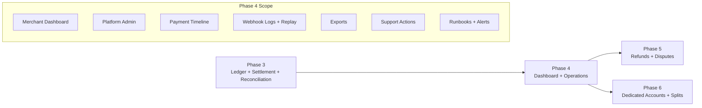
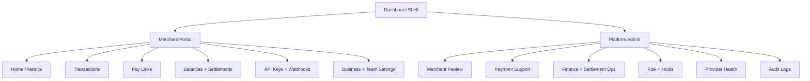
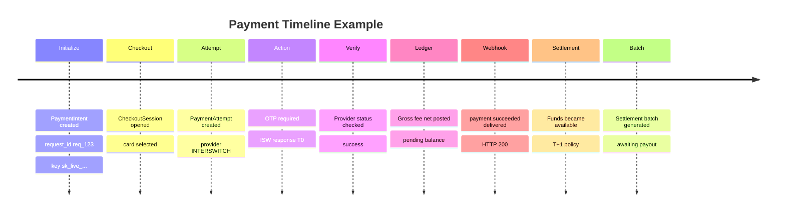
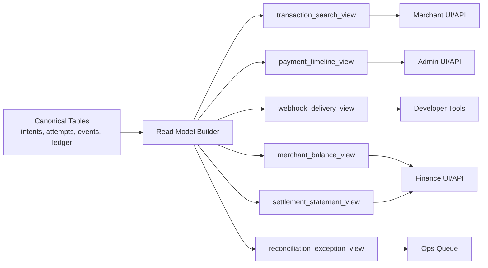
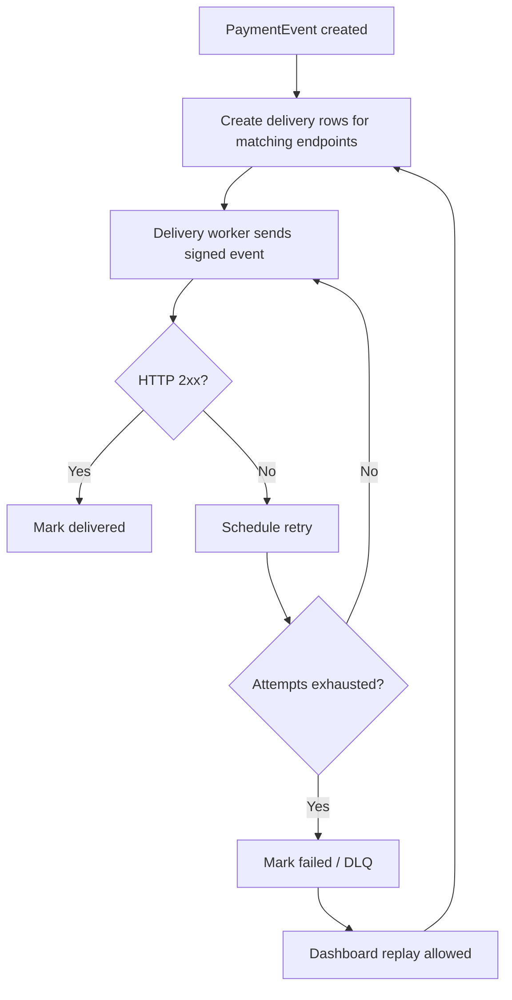

# Phase 4: Dashboard And Operations

Phase 4 makes the gateway operable. A payment gateway is not production-ready just because payments can succeed. Merchants, support, finance, risk, and engineering need to see what happened, replay what is safe to replay, export what they need, and act without raw database access.

This phase builds the dashboard and operational read models on top of the payment, provider-event, ledger, webhook, settlement, and reconciliation records created in earlier phases.

## Phase Contract

| Field | Definition |
| --- | --- |
| Primary outcome | Merchant dashboard, platform/admin cockpit, transaction timeline, webhook logs and replay, exports, support tools, finance views, and operational runbooks. |
| Entry condition | Phases 1-3 produce canonical payment, provider event, ledger, settlement, webhook, and reconciliation data. |
| Exit condition | Merchant and platform operators can answer "what happened?" for a payment without database access, replay merchant webhooks safely, export transactions/statements, and inspect settlement/reconciliation status. |
| Non-goal | Refund automation, dispute workflows, dedicated accounts, split settlements, or provider-credential management UI beyond controlled admin inspection. |
| Next phase dependency | Phase 5 can add refunds and disputes into existing timeline, ledger, webhook, and admin patterns. |

## Whole-System Fit

If the repository remains backend-only, this phase still applies: build the read APIs, admin APIs, and data contracts first. A separate frontend can consume the same contracts without changing payment logic.

## User Surfaces

## Baseline Inputs To Carry Forward

| Baseline area | Current evidence | Phase 4 interpretation |
| --- | --- | --- |
| Transaction listing | `gateway-baseline/src/modules/transaction/transaction.service.ts` lists and filters transactions | Keep merchant/admin filtering, but use read models backed by PaymentIntent, attempts, ledger, and settlement status. |
| Transaction detail | Baseline switches details by transaction category | Replace category-specific row logic with timeline and normalized channel/provider details. |
| Exports | Baseline uses queue-backed CSV exports and S3 upload | Keep async exports; add ledger-backed columns, filters, audit logs, and export status. |
| Pay links | `gateway-baseline/src/modules/paylink/paylink.service.ts` lists and manages pay links | Keep pay-link management as merchant dashboard surface, backed by PaymentIntent/CheckoutSession. |
| Bull board | `gateway-baseline/src/queues/index.ts` exposes queue board | Keep queue visibility for internal ops, but do not make it the main operational UI. |
| Merchant webhook setup | Baseline stores one `webhookURL` on merchant | Replace with webhook endpoint records, delivery logs, event replay, and endpoint status. |

## Operational Information Architecture

| Area | Merchant sees | Platform/admin sees |
| --- | --- | --- |
| Home | Volume, success rate, pending transfers, available balance, next settlement | Platform volume, provider health, queue backlogs, risk alerts |
| Transactions | Search, filters, detail, timeline, receipt/export | Full timeline, provider evidence, ledger entries, exception actions |
| Pay links | Create, activate/deactivate, copy URL, payment history | Merchant pay-link inspection and abuse/risk flags |
| Balances | Pending, available, held, settlements, statements | Ledger accounts, settlement batches, reconciliation results |
| Webhooks | Endpoints, delivery logs, replay | Endpoint health, response bodies, replay controls, pause/resume |
| Developers | API keys, test/live mode, docs links | Key audit, last used, revoke/rotate support |
| Merchant review | Not applicable or status only | KYB, risk tier, limits, approve/suspend/request info |
| Provider health | Channel availability messages | Provider latency/errors, credential version, maintenance toggles |

## Payment Timeline

The transaction timeline is the center of Phase 4. It should be explainable, chronological, and evidence-backed.

Timeline event sources:

| Source | Timeline entries |
| --- | --- |
| `payment_intents` | Created, expired, canceled, succeeded, failed. |
| `checkout_sessions` | Opened, selected channel, expired. |
| `payment_attempts` | Created, action required, processing, succeeded, failed. |
| `provider_events` | Received, validated, duplicate, rejected, processed, needs review. |
| `payment_events` | Merchant-visible event creation. |
| `ledger_entries` | Gross/fee/net postings, holds, availability, settlement movements. |
| `webhook_deliveries` | Delivery attempts, responses, retries, replay. |
| `settlement_batches` | Eligible, batched, approved, paid, failed, reconciled. |
| `audit_logs` | Manual admin actions. |

## Read Model Architecture

Rules:

- Read models must be rebuildable from canonical data.
- Read models should never become the source of money truth.
- Dashboard actions must call domain services, not edit read models.
- Every admin action must create an audit log.

## Merchant Dashboard Scope

### Home

| Widget | Data source | Notes |
| --- | --- | --- |
| Today volume | Ledger/read model | Gross and net by channel. |
| Success rate | Payment events | Filter by test/live and date. |
| Pending transfer count | Transfer attempts/read model | Highlight expired or exception transfers. |
| Available balance | Ledger balance view | Currency-specific. |
| Next settlement | Settlement batches and policies | Show expected date and status. |

### Transactions

Required filters:

- Reference
- Date range
- Status
- Channel
- Amount range
- Customer email
- Settlement status
- Test/live mode

Transaction detail should show:

- Intent data: reference, amount, currency, customer, metadata.
- Attempt data: channel, provider, safe provider reference, action/status.
- Payment evidence: provider events, verification result, timestamps.
- Financial data: gross, fee, net, pending/available/settled.
- Webhook data: event ids, delivery status, replay availability.

### Developers

| Feature | Minimum behavior |
| --- | --- |
| API keys | View prefixes, create, revoke, rotate, last used. Full secret shown only once. |
| Webhook endpoints | Create/update endpoint, status, event filters. |
| Webhook logs | List events, attempts, response code, next retry. |
| Replay | Replay selected event to active endpoint with audit log. |
| Test mode | Toggle or filter test/live data. |

### Balances And Settlements

- Show pending, available, held, settlement payable, and paid totals.
- Show settlement statements with included payments.
- Allow CSV export.
- Show explanation for holds and exceptions.

## Platform/Admin Dashboard Scope

| Module | Required actions | Evidence needed |
| --- | --- | --- |
| Merchant review | Approve, suspend, request info, set risk tier/limits | KYB data, transaction history, audit trail. |
| Payment support | Inspect timeline, retry status check, create exception note | Provider events, attempts, ledger entries, webhooks. |
| Virtual account ops | Find account, expire account, link unmatched transfer with approval | Account assignment, provider event, amount, expiry. |
| Webhook ops | Pause endpoint, replay event, inspect delivery response | Event id, signature inputs, response code/body. |
| Settlement ops | Generate/approve/mark paid/reconcile batches | Ledger balances, payout evidence, provider/bank reports. |
| Reconciliation | Review exceptions, assign owner, resolve with adjustment or match | Provider statements, ledger groups, audit approvals. |
| Provider health | Disable routing, set maintenance, inspect error rate | Provider metrics, queue backlog, credential version. |
| Audit | Search sensitive actions | Actor, target, before/after metadata, request id. |

## Webhook Logs And Replay

Replay rules:

- Replay uses the original event id unless the product explicitly creates a new replay id with reference to the original.
- Replay must be audit-logged.
- Replay should not regenerate payment or ledger state.
- Replay signs the outbound body with current endpoint secret unless policy requires historical signature.
- Replay should be blocked for inactive or deleted endpoints unless admin overrides.

## Exports

| Export | Audience | Required columns |
| --- | --- | --- |
| Transactions | Merchant, support | Reference, date, channel, status, amount, fee, net, currency, customer, settlement status. |
| Settlements | Merchant, finance | Batch id, period, gross, fees, net, bank account, status, paid at, reconciliation status. |
| Webhooks | Developer/support | Event id, type, endpoint, attempt count, latest status, response code, next retry. |
| Reconciliation exceptions | Finance/ops | Exception id, type, merchant, provider, amount, age, status, owner. |
| Audit logs | Admin/security | Actor, action, target, request id, timestamp, metadata summary. |

Exports should be queued, access-controlled, time-limited, and audit-logged.

## Admin Actions And Guardrails

| Action | Guardrail |
| --- | --- |
| Replay webhook | Requires permission, event must exist, endpoint active, audit log created. |
| Retry provider status check | Does not bypass provider-event inbox; result persisted as evidence. |
| Resolve reconciliation exception | Requires reason and evidence; money movement uses balanced adjustment. |
| Hold merchant funds | Requires finance/risk role and reason; ledger movement or hold flag recorded. |
| Release held funds | Requires audit trail and checks for unresolved disputes/exceptions. |
| Disable provider routing | Requires platform admin role; records provider health/maintenance reason. |
| Rotate API key | Shows secret once, revokes old key according to grace policy, audit log. |

## Implementation Workplan

### 1. Build Read APIs

- Transaction search API backed by read model.
- Payment timeline API.
- Webhook delivery API.
- Balance and settlement statement APIs.
- Reconciliation exception APIs.
- Audit log search API.

### 2. Build Read Model Jobs

- Event-driven updates for new payments, provider events, ledger postings, webhooks, and settlements.
- Rebuild command/job for each read model.
- Lag metrics for read-model freshness.
- Backfill existing data if migrating from baseline.

### 3. Build Merchant Dashboard

- Home metrics.
- Transactions list/detail.
- Pay links management.
- Balances and settlements.
- API keys and webhook endpoints.
- Exports.

### 4. Build Platform/Admin Dashboard

- Payment support timeline.
- Reconciliation exception queue.
- Settlement operations.
- Merchant review/status controls.
- Provider health and routing controls.
- Audit log explorer.

### 5. Build Webhook Operations

- Delivery log details.
- Replay controls.
- Endpoint pause/resume.
- Response body storage policy.
- DLQ visibility.

### 6. Build Runbooks

- Provider card outage.
- VPS webhook delay.
- Merchant webhook outage.
- Ledger imbalance.
- Settlement payout failure.
- Key leak or credential rotation.
- Reconciliation backlog.

## Observability

| Metric | Why it matters |
| --- | --- |
| `dashboard.api.latency_ms` | Keeps operations usable. |
| `read_models.lag_seconds` | Detects stale dashboard data. |
| `exports.queue_depth` | Detects export bottlenecks. |
| `webhooks.dlq_total` | Reveals merchant delivery failures. |
| `support.actions_total` | Audits operational intervention volume. |
| `reconciliation.exception_age_seconds` | Drives finance queue SLA. |
| `provider.health_state` | Feeds admin routing decisions. |

## Test Matrix

| Area | Test | Expected result |
| --- | --- | --- |
| Transaction search | Filter by merchant/date/status/channel | Correct scoped results, no cross-merchant leakage. |
| Timeline | Payment with card OTP success | Chronological events with provider, ledger, webhook, settlement entries. |
| Webhook replay | Replay failed event | New delivery attempt created, no payment mutation. |
| Endpoint auth | Merchant accesses another merchant webhook log | Request denied. |
| Balance display | Merchant with pending and available funds | Values match ledger-derived balance view. |
| Settlement statement | Batch with multiple payments | Gross, fees, net, and items match ledger. |
| Export | Merchant requests transaction export | Queued job produces scoped CSV and audit log. |
| Admin action | Admin resolves exception | Audit log created and required evidence captured. |
| Read model rebuild | Rebuild timeline from canonical data | Same timeline produced. |
| Provider health | Admin disables provider route | New attempts stop routing to disabled provider. |

## Exit Criteria

Phase 4 is complete when:

- Merchant can view transaction list, transaction detail, balances, settlements, API keys, webhook endpoints, and exports.
- Platform support can inspect a full payment timeline without database access.
- Finance can inspect settlement batches and reconciliation exceptions.
- Merchant webhook logs show event id, endpoint, attempts, response status, and replay availability.
- Webhook replay works without re-mutating payment or ledger state.
- Exports are queued, scoped, downloadable, and audit-logged.
- Read models are rebuildable and monitored for lag.
- Admin actions are permissioned and audit-logged.
- Runbooks exist for core payment, webhook, ledger, provider, and settlement incidents.

## Handoff To Phase 5

Phase 5 can assume:

- Payment timeline can display new event types.
- Ledger entries and settlement status are visible to operators.
- Admin actions have permission and audit patterns.
- Merchant webhooks have logs and replay.
- Reconciliation exceptions have queues and ownership.

Refunds and disputes must plug into these existing surfaces. They should add new resources and timeline events, not create a separate operational world.
