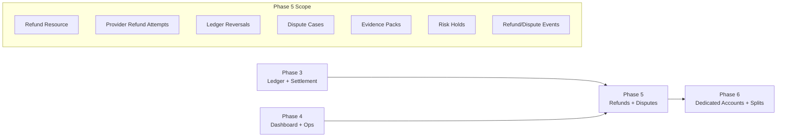
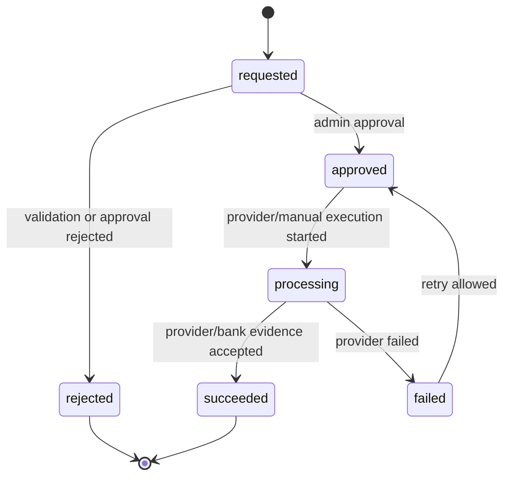
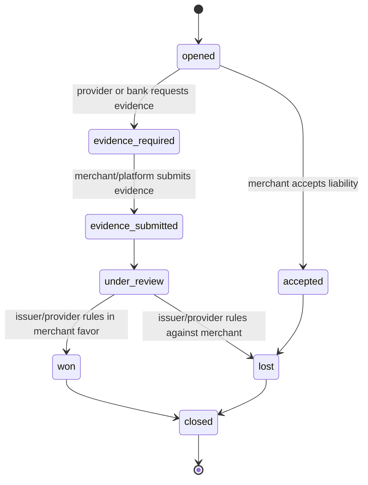
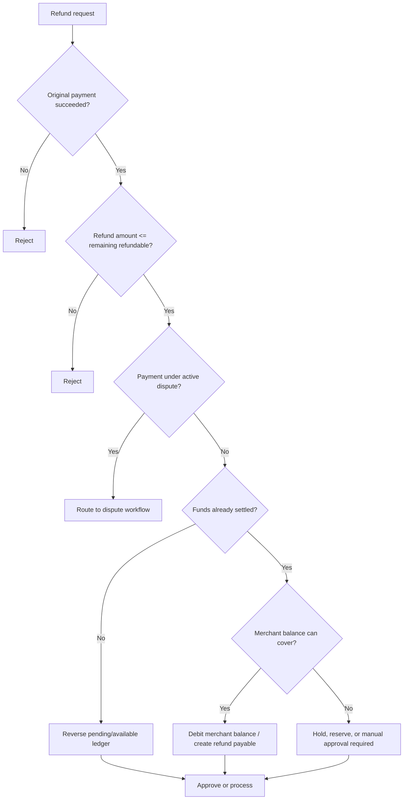
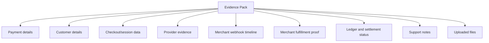

# Phase 5: Refunds And Disputes

Phase 5 adds post-payment operations: refunds and disputes. These are not transaction status edits. They are separate resources with their own lifecycle, evidence, ledger postings, provider actions, webhooks, support workflows, and audit requirements.

This phase should launch conservatively: admin/manual approval first, provider automation only where the rail and controls are ready, and every money movement backed by balanced ledger entries.

## Phase Contract

| Field | Definition |
| --- | --- |
| Primary outcome | Refund resources, refund attempts, ledger reversals, provider refund adapters where available, dispute cases, evidence packs, admin workflows, merchant visibility, and webhook events. |
| Entry condition | Phase 3 ledger and settlement model is live. Phase 4 operations dashboard and timeline exist. |
| Exit condition | An operator can create, approve, process, and track refunds; disputes can be opened and managed with evidence; ledger reversals are balanced; merchants can see outcomes and receive webhook events. |
| Non-goal | Fully automated chargeback representment, instant refund guarantees, recurring billing, or advanced risk scoring. |
| Next phase dependency | Phase 6 can use refund/dispute-safe ledger and settlement behavior before adding dedicated accounts and splits. |

## Whole-System Fit



## Product Slice

Phase 5 should support:

- Admin creates a refund request against a successful payment.
- System validates refundable amount, rail, settlement state, dispute state, and merchant balance.
- Admin approves or rejects the refund.
- Provider refund is initiated when supported and policy allows.
- Ledger reversal or hold is posted.
- Merchant sees refund state and receives events.
- Dispute case can be opened with payment evidence, deadlines, notes, files, and outcome.
- Dispute outcome can create holds, reversals, or adjustments.

## Baseline Inputs To Carry Forward

The baseline does not contain a full refund or dispute model. Useful inherited patterns are indirect:

| Baseline area | Current evidence | Phase 5 interpretation |
| --- | --- | --- |
| Transaction detail | `gateway-baseline/src/modules/transaction/transaction.service.ts` can retrieve transaction context | Extend Phase 4 timeline/detail views to show refunds and disputes. |
| Queue processing | `gateway-baseline/src/queues/index.ts` supports async jobs | Use queues for provider refund attempts, evidence generation, webhook delivery, and exports. |
| Merchant webhooks | `gateway-baseline/src/webhooks/services/commons.ts` signs callbacks | Reuse Phase 4 webhook logs/replay with new event types. |
| Charges | `gateway-baseline/src/modules/platform/models/charges.model.ts` models fee inputs | Refund fee policy must explicitly decide whether fees are refunded, retained, or partially reversed. |

## Target Objects

| Object | Purpose | Notes |
| --- | --- | --- |
| `refunds` | Merchant/admin refund request and lifecycle | Linked to PaymentIntent, PaymentAttempt, merchant, and original ledger groups. |
| `refund_attempts` | Provider-specific refund execution attempts | May be manual for bank transfer and automated for supported card rails. |
| `refund_events` or `payment_events` | Normalized refund lifecycle events | Feed timeline and merchant webhooks. |
| `dispute_cases` | Chargeback/customer dispute lifecycle | Linked to original payment and merchant. |
| `dispute_evidence` | Files, notes, delivery proof, customer/order metadata | Access-controlled. |
| `risk_holds` | Funds held because of refund/dispute risk | Backed by ledger movement or hold flags. |
| `manual_adjustments` | Audited corrections | Reuses Phase 3 balanced adjustment workflow. |

## Refund State Machine



Refund statuses:

| Status | Meaning |
| --- | --- |
| `requested` | Refund has been created but not approved. |
| `approved` | Controls passed and operator approved processing. |
| `processing` | Provider/manual refund execution has started. |
| `succeeded` | Refund is complete and ledger reversal is finalized. |
| `failed` | Refund attempt failed and can be retried or manually resolved. |
| `rejected` | Refund will not be processed. |

## Dispute State Machine



Dispute statuses:

| Status | Meaning |
| --- | --- |
| `opened` | Dispute has been received or manually created. |
| `evidence_required` | Merchant/platform must upload evidence by deadline. |
| `evidence_submitted` | Evidence has been sent. |
| `under_review` | Awaiting provider/issuer outcome. |
| `won` | Merchant/platform wins dispute. |
| `lost` | Funds are reversed or liability accepted. |
| `accepted` | Merchant/platform accepts dispute without contest. |
| `closed` | Final operational state. |

## Refund Eligibility



Eligibility checks:

| Check | Rule |
| --- | --- |
| Payment state | Original payment must be `succeeded`. |
| Remaining amount | Sum of successful and processing refunds cannot exceed captured amount. |
| Currency | Refund currency matches original payment currency. |
| Rail support | Provider refund path must exist or manual refund process must be selected. |
| Settlement state | If already settled, merchant balance/hold/reserve policy must cover the refund. |
| Dispute state | Active disputes may block ordinary refund or convert into dispute resolution. |
| Risk | High-risk merchant/payment may require additional approval. |

## Refund Ledger Patterns

### Refund before settlement

Reverse merchant pending or available balance and reduce collection cash/refund payable according to operating model.

| Entry | Account | Debit | Credit |
| --- | --- | ---: | ---: |
| 1 | Merchant pending or available balance | 985000 | 0 |
| 2 | Platform fee income or fee refund policy account | 15000 | 0 |
| 3 | Provider collection cash or refund payable | 0 | 1000000 |

### Refund after settlement

If merchant already received funds, debit merchant available balance, held balance, reserve, or create receivable according to policy.

| Entry | Account | Debit | Credit |
| --- | --- | ---: | ---: |
| 1 | Merchant available balance or reserve | 1000000 | 0 |
| 2 | Refund payable / provider collection cash | 0 | 1000000 |

Exact postings depend on fee policy, settlement state, and provider operating model. The invariant is fixed: the posting group must balance and link to refund id, original payment id, approval actor, and evidence.

## Dispute Ledger Patterns

| Scenario | Ledger behavior |
| --- | --- |
| Dispute opened before settlement | Move disputed amount from pending/available to held balance. |
| Dispute opened after settlement | Debit merchant reserve/available balance or create merchant receivable. |
| Dispute won | Release held funds back to pending/available or reverse receivable. |
| Dispute lost | Move held funds to provider/bank chargeback payable or finalize reversal. |
| Merchant accepts liability | Same as lost, with accepted outcome event. |

## Provider Refund Adapter

```ts
interface ProviderRefundAdapter {
  provider: "INTERSWITCH" | "VPS" | "MPGS";
  supportsRail(input: RefundSupportInput): Promise<RefundSupportResult>;
  createRefund(input: CreateProviderRefundInput): Promise<ProviderRefundResult>;
  verifyRefund(input: VerifyProviderRefundInput): Promise<ProviderRefundResult>;
  parseRefundWebhook(input: RawProviderWebhook): Promise<ParsedProviderEvent>;
}
```

Launch posture:

| Rail | Recommended initial handling |
| --- | --- |
| ISW local card | Provider refund adapter if ISW supports the needed refund endpoint and contracts are approved; otherwise admin/manual workflow. |
| Bank transfer | Manual bank transfer refund or operator-managed payout first; automation later. |
| MPGS international card | Implement when MPGS direct integration is live and provider refund behavior is tested. |

## API And Admin Contract

### Merchant-facing

| Endpoint | Purpose | Initial access |
| --- | --- | --- |
| `GET /v1/refunds` | List refunds | Merchant read. |
| `GET /v1/refunds/:id` | Refund detail | Merchant read. |
| `POST /v1/refunds` | Create refund request | Optional in launch; can be admin-only first. |
| `GET /v1/disputes` | List disputes | Merchant read. |
| `GET /v1/disputes/:id` | Dispute detail and evidence deadline | Merchant read. |
| `POST /v1/disputes/:id/evidence` | Upload/submit evidence | Merchant/admin, controlled. |

### Admin-facing

| Endpoint | Purpose |
| --- | --- |
| `POST /admin/refunds` | Create refund request for a payment. |
| `POST /admin/refunds/:id/approve` | Approve processing. |
| `POST /admin/refunds/:id/reject` | Reject with reason. |
| `POST /admin/refunds/:id/process` | Start provider/manual execution. |
| `POST /admin/refunds/:id/mark-succeeded` | Attach manual/provider evidence and finalize. |
| `POST /admin/disputes` | Open dispute case. |
| `POST /admin/disputes/:id/hold` | Hold funds. |
| `POST /admin/disputes/:id/evidence` | Add evidence. |
| `POST /admin/disputes/:id/outcome` | Mark won/lost/accepted. |

## Event Catalog

| Event | Trigger |
| --- | --- |
| `refund.requested` | Refund resource created. |
| `refund.approved` | Operator approves refund. |
| `refund.rejected` | Refund rejected. |
| `refund.processing` | Provider/manual refund execution starts. |
| `refund.succeeded` | Refund completes and ledger finalizes. |
| `refund.failed` | Provider/manual refund fails. |
| `dispute.opened` | Dispute case created. |
| `dispute.evidence_required` | Evidence deadline set. |
| `dispute.evidence_submitted` | Evidence submitted. |
| `dispute.won` | Merchant/platform wins. |
| `dispute.lost` | Merchant/platform loses. |
| `dispute.closed` | Case closed. |

Merchant webhook delivery should be configurable by endpoint event filters.

## Evidence Pack



Evidence should be access-controlled and retention-aware.

Minimum evidence fields:

- Payment reference, amount, currency, date, channel, provider.
- Safe card metadata or transfer account details.
- Customer email/name/metadata if available.
- Provider authorization/capture/transfer evidence.
- Checkout IP/device metadata if collected lawfully.
- Merchant order metadata.
- Webhook delivery timeline.
- Settlement status and ledger movement.
- Files, notes, and submitted response.

## Implementation Workplan

### 1. Refund Resource And Validation

- Add refund tables and state machine.
- Compute remaining refundable amount.
- Check settlement state, dispute state, merchant balance, and rail support.
- Add admin create/approve/reject endpoints.
- Add merchant read endpoints.

### 2. Ledger Reversals And Holds

- Implement balanced refund postings.
- Implement partial refund behavior.
- Implement fee refund policy.
- Implement holds for disputed or risky payments.
- Add trial-balance tests for refund/dispute postings.

### 3. Provider Refund Attempts

- Add provider refund adapter interface.
- Implement simulator first.
- Add rail-specific adapter only after provider behavior is tested.
- Persist provider refund evidence in ProviderEvent or refund attempt data.
- Support retry and manual resolution.

### 4. Dispute Cases

- Add dispute state machine.
- Add evidence pack generation.
- Add deadlines and owner assignment.
- Add merchant/admin evidence upload.
- Add outcome handling with ledger consequences.

### 5. Dashboard Integration

- Add refund and dispute tabs to transaction timeline.
- Add refund queue for finance/support.
- Add dispute workbench.
- Add evidence pack viewer.
- Add audit logs for approvals, rejections, holds, releases, outcomes.

### 6. Webhooks And Exports

- Emit refund and dispute events.
- Add webhook filters.
- Add refund/dispute exports.
- Reuse Phase 4 delivery logs and replay.

## Observability

| Metric | Why it matters |
| --- | --- |
| `refunds.requested_total` | Tracks refund volume. |
| `refunds.succeeded_total` | Tracks completed refunds. |
| `refunds.failed_total` | Reveals provider/manual failures. |
| `refunds.processing_age_seconds` | Detects stuck refunds. |
| `disputes.open_total` | Tracks dispute exposure. |
| `disputes.evidence_due_soon_total` | Prevents missed deadlines. |
| `disputes.lost_amount_minor` | Tracks financial impact. |
| `holds.amount_minor` | Tracks funds under risk hold. |

## Test Matrix

| Area | Test | Expected result |
| --- | --- | --- |
| Refund validation | Refund failed payment | Rejected. |
| Over-refund | Refund amount exceeds remaining | Rejected. |
| Partial refund | Refund half of successful payment | Balanced reversal, remaining refundable updated. |
| Duplicate refund processing | Same refund processed twice | One provider attempt or idempotent result. |
| Refund after settlement | Merchant balance covers amount | Correct debit and refund payable posting. |
| Refund without balance | Merchant cannot cover | Hold/manual approval path triggered. |
| Fee policy | Merchant-borne fee refunded or retained | Ledger follows configured policy. |
| Dispute open | Open dispute on successful payment | Case created, timeline updated, optional hold posted. |
| Dispute won | Release held funds | Balanced release posting. |
| Dispute lost | Finalize reversal | Balanced loss/reversal posting. |
| Webhook | Refund succeeds | Merchant receives signed `refund.succeeded`. |
| Evidence | Generate evidence pack | Includes payment, provider, ledger, webhook, and notes. |

## Exit Criteria

Phase 5 is complete when:

- Refunds are first-class resources linked to original payments.
- Refund eligibility correctly accounts for payment status, remaining amount, settlement state, dispute state, and merchant balance.
- Refund lifecycle is state-machine controlled.
- Refund ledger postings are balanced and immutable.
- Provider/manual refund attempts are tracked with evidence.
- Dispute cases can be opened, assigned, updated, and closed.
- Dispute holds and outcomes produce correct ledger movements.
- Refund and dispute events appear in transaction timelines.
- Merchant webhooks support refund/dispute events with logs and replay.
- Admin approvals and outcomes are permissioned and audit-logged.

## Handoff To Phase 6

Phase 6 can assume:

- Ledger supports reversals, holds, and adjustments.
- Timeline can display post-payment operations.
- Webhook event catalog supports non-payment-success events.
- Admin workflows exist for financial approvals and evidence.

Dedicated accounts and splits must respect refund and dispute behavior from the start. A split payment is not complete if refund/dispute liability cannot be allocated.
