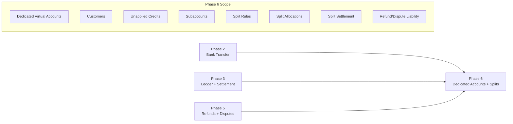
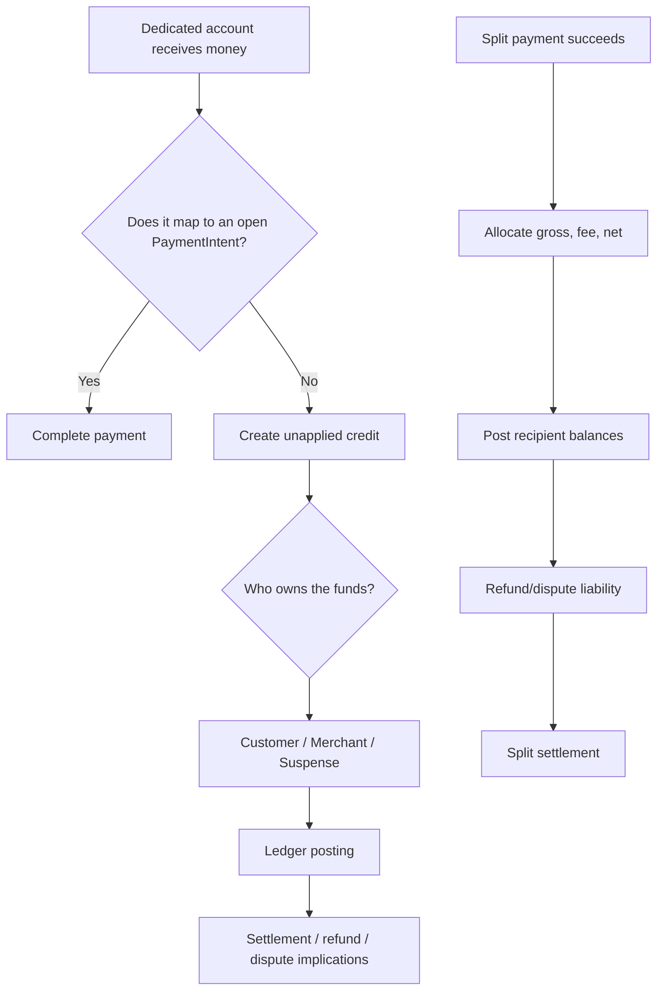
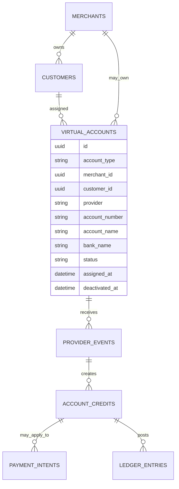
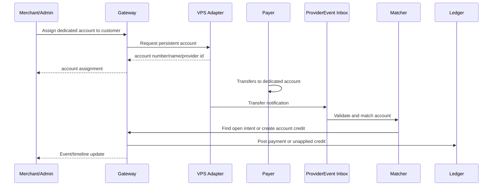
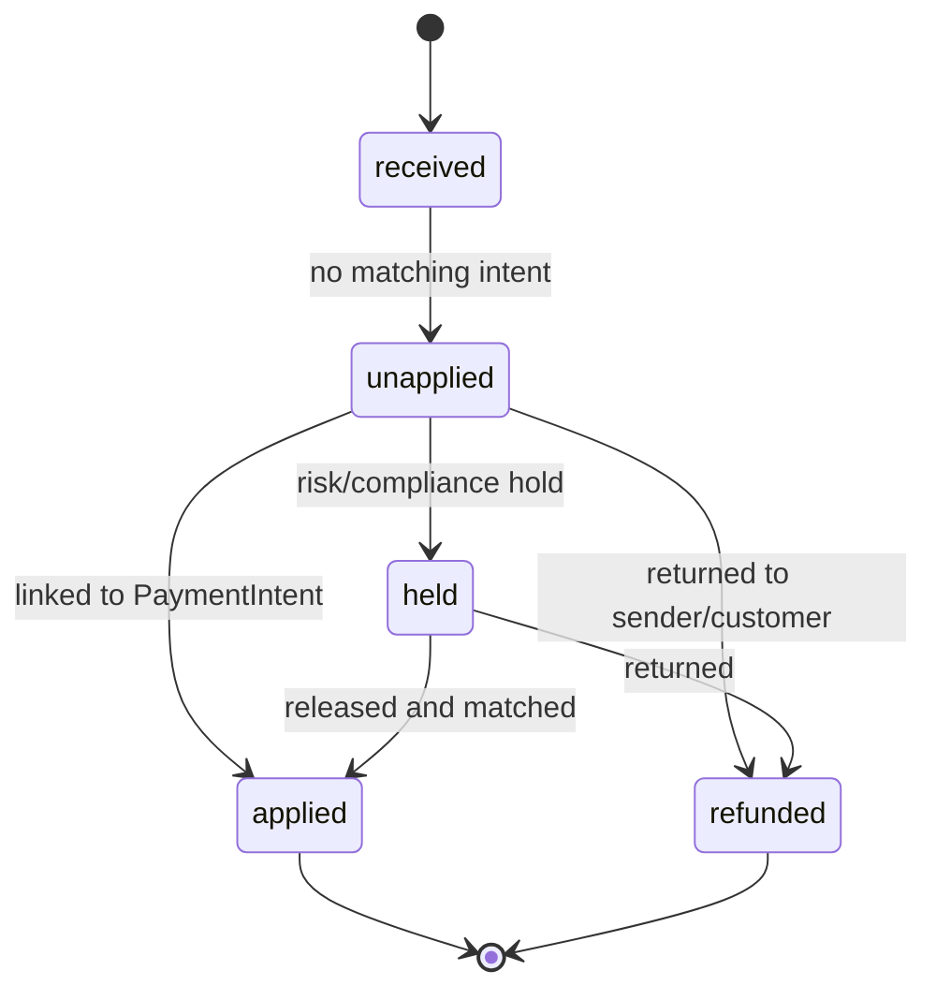
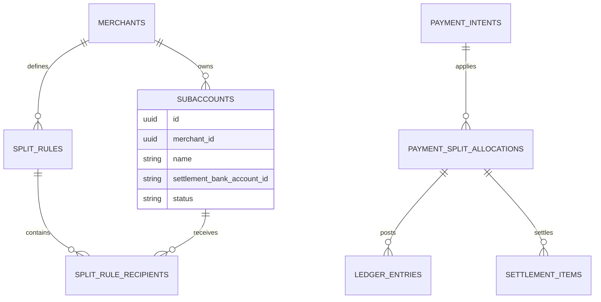
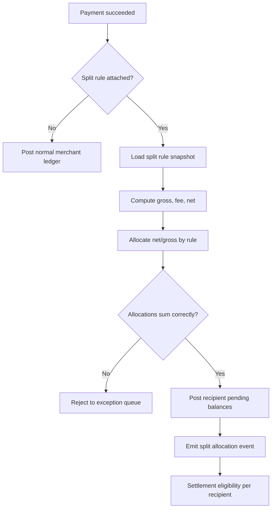

# Phase 6: Dedicated Accounts And Splits

Phase 6 expands the gateway into more advanced collection and marketplace use cases. It adds dedicated virtual accounts for repeat transfer collection, customer or merchant wallet funding, and split settlement rules for marketplaces or multi-party payments.

This phase intentionally comes after the core rails, ledger, settlement, operations, refunds, and disputes are stable. Dedicated accounts and splits multiply edge cases. They should reuse the existing financial truth rather than introduce a second balance system.

## Phase Contract

| Field | Definition |
| --- | --- |
| Primary outcome | Dedicated virtual accounts, customer/account assignments, unapplied-credit handling, subaccounts, split rules, split allocations, split settlement, and refund/dispute-aware liability. |
| Entry condition | Dynamic bank transfer, ledger, settlement, operations, refunds, and disputes are live or stable enough to extend. |
| Exit condition | A pilot merchant can use dedicated accounts and/or split rules with correct attribution, ledger postings, settlement allocation, reconciliation, refund handling, and operational visibility. |
| Non-goal | Full banking wallet product, lending, card issuing, arbitrary money movement, or unbounded marketplace risk automation. |
| Next phase dependency | This phase enables product expansion: marketplace payments, B2B invoicing, repeat customer transfer accounts, and advanced merchant products. |

## Whole-System Fit

## Product Slice

Phase 6 should support two expansion paths:

| Path | Use case | Minimum pilot |
| --- | --- | --- |
| Dedicated accounts | Repeat customer or merchant-specific transfer account | Assign a persistent account, match incoming transfer, create payment/credit, reconcile and settle. |
| Splits | Marketplace or multi-party payments | Apply a split rule to a successful payment, allocate ledger balances to recipients, settle according to policy. |

These paths can launch separately. The shared dependency is ledger-backed attribution and settlement.

## Why This Comes Last

Dedicated accounts can receive unexpected payments. Splits can create multiple beneficiaries for one payment. Both require strong ledger, exception, refund, dispute, and operations support.

## Baseline Inputs To Carry Forward

| Baseline area | Current evidence | Phase 6 interpretation |
| --- | --- | --- |
| Dynamic account generation | `gateway-baseline/src/modules/transfer/transfer.service.ts` | Reuse provider account assignment pattern, but extend account lifecycle from one-time checkout to persistent assignment. |
| VPS webhook matching | `gateway-baseline/src/webhooks/services/vps.ts` | Keep account-number matching, add customer/merchant assignment, unapplied credit, and account status checks. |
| Merchant charges | `gateway-baseline/src/modules/platform/models/charges.model.ts` | Split rules must define fee bearer and recipient allocation explicitly. |
| Pay links | `gateway-baseline/src/modules/paylink/paylink.service.ts` | Pay links can optionally carry split rules later, but not as the first pilot unless required. |

## Dedicated Account Model

Dedicated account types:

| Type | Owner | Behavior |
| --- | --- | --- |
| `customer_dedicated` | Merchant customer | Persistent account for repeat customer payments. |
| `merchant_dedicated` | Merchant | Persistent account for wallet funding or B2B transfer collection. |
| `dynamic` | PaymentIntent | Existing Phase 2 one-time checkout account. |

Dedicated account statuses:

| Status | Meaning |
| --- | --- |
| `active` | Can receive and match transfers. |
| `suspended` | Provider/account exists but new credits require review. |
| `deactivated` | Should not accept new payments; late credits become exceptions. |
| `pending_provider` | Requested but provider has not confirmed. |

## Dedicated Account Transfer Flow

## Matching Policy For Dedicated Accounts

| Scenario | Behavior |
| --- | --- |
| Transfer matches open PaymentIntent by reference/amount/window | Complete the intent and post normal payment ledger. |
| Transfer to customer DVA with no open intent | Create unapplied customer credit or merchant credit according to product policy. |
| Transfer below expected amount | Create underpayment exception or partial credit policy. |
| Transfer above expected amount | Apply expected amount and send excess to suspense, or create manual-review exception. |
| Transfer to suspended/deactivated account | Create exception; do not auto-credit merchant. |
| Duplicate provider notification | Deduplicate; do not double-credit. |
| Unknown account | Reconciliation exception. |

## Unapplied Credits

Dedicated accounts need a place for money that is real but not tied to a specific order.

Unapplied credit rules:

- Must be ledger-backed.
- Must identify account, merchant, provider event, amount, currency, and sender metadata when available.
- Must be visible to operations.
- Must be resolvable by applying to an intent, refunding, holding, or moving to suspense.
- Must not silently inflate merchant available balance unless product policy explicitly allows it and settlement rules are satisfied.

## Split Payment Model

Target split objects:

| Object | Purpose |
| --- | --- |
| `subaccounts` | Settlement recipients under a merchant or platform marketplace. |
| `split_rules` | Reusable allocation rule. |
| `split_rule_recipients` | Recipients, percentages, flat amounts, fee-bearing behavior. |
| `payment_split_allocations` | Immutable allocation snapshot for one payment. |
| `recipient_ledger_accounts` | Pending/available/held balances per recipient. |
| `split_settlement_items` | Settlement items by recipient and policy. |

## Split Rule Types

| Type | Behavior | Example |
| --- | --- | --- |
| Percentage | Allocate net or gross by percentage | Vendor 90 percent, platform 10 percent. |
| Flat | Allocate fixed amount first | Delivery partner gets NGN 500. |
| Hybrid | Flat amount plus percentage | Partner fee plus seller share. |
| Fee bearer | Merchant, customer, platform, or recipient bears fee | Platform absorbs card fee, recipients get full allocation. |
| Settlement recipient override | One recipient receives settlement for multiple parties | Useful for managed marketplaces. |

Launch recommendation:

- Start with percentage splits on net amount.
- Support one platform fee recipient and one or more seller/subaccount recipients.
- Freeze allocation snapshot at payment success.
- Defer complex nested, conditional, and time-based splits.

## Split Allocation Flow

## Split Ledger Example

Payment net amount after fees is NGN 9,850.00. Split rule: seller 90 percent, platform marketplace 10 percent.

| Entry | Account | Debit | Credit |
| --- | --- | ---: | ---: |
| 1 | Provider collection cash | 1000000 | 0 |
| 2 | Platform fee income | 0 | 15000 |
| 3 | Seller pending balance | 0 | 886500 |
| 4 | Marketplace pending balance | 0 | 98500 |

Credits equal NGN 10,000.00 if fee income is included. Recipient credits equal net amount.

## Refund And Dispute Liability For Splits

Splits are incomplete without reversal rules.

| Scenario | Required behavior |
| --- | --- |
| Full refund before settlement | Reverse all recipient allocations according to original split. |
| Partial refund | Allocate refund across recipients by original allocation ratio or explicit liability rule. |
| Refund after one recipient settled | Debit recipient available balance, reserve, or receivable. |
| Dispute opened | Hold affected recipient balances or merchant/platform reserve. |
| Dispute lost | Reverse according to liability policy. |
| Split recipient inactive | Block new allocations; existing liability remains traceable. |

Liability should be explicit in `split_rules`:

- `liability_mode=proportional`
- `liability_mode=merchant_primary`
- `liability_mode=platform_primary`
- `liability_mode=recipient_specific`

## API Contract

### Dedicated accounts

| Endpoint | Purpose |
| --- | --- |
| `POST /v1/customers` | Create or update merchant customer. |
| `POST /v1/customers/:id/dedicated-accounts` | Assign dedicated account. |
| `GET /v1/customers/:id/dedicated-accounts` | List customer accounts. |
| `POST /admin/dedicated-accounts/:id/suspend` | Suspend account. |
| `POST /admin/account-credits/:id/apply` | Apply unapplied credit to intent. |
| `POST /admin/account-credits/:id/refund` | Refund unapplied credit. |

### Splits

| Endpoint | Purpose |
| --- | --- |
| `POST /v1/subaccounts` | Create settlement recipient. |
| `GET /v1/subaccounts` | List recipients. |
| `POST /v1/split-rules` | Create split rule. |
| `GET /v1/split-rules/:id` | Retrieve split rule. |
| `POST /v1/transactions/initialize` | Accept optional `split_rule_id` or inline split instructions when enabled. |
| `GET /v1/transactions/:reference/split` | Retrieve allocation snapshot. |
| `GET /v1/settlements/:id` | Include split settlement items when present. |

## Event Catalog

| Event | Trigger |
| --- | --- |
| `dedicated_account.assigned` | Persistent account assigned to customer/merchant. |
| `dedicated_account.suspended` | Account suspended. |
| `account_credit.received` | Transfer received without direct payment match. |
| `account_credit.applied` | Credit applied to PaymentIntent. |
| `account_credit.refunded` | Credit returned. |
| `split_rule.created` | Merchant creates split rule. |
| `payment.split_allocated` | Successful payment allocation snapshot created. |
| `split.settlement.created` | Split settlement items generated. |
| `split.refund_allocated` | Refund liability allocated across recipients. |
| `split.dispute_held` | Dispute hold applied to recipient balances. |

## Implementation Workplan

### 1. Dedicated Account Foundations

- Add customers if not already present.
- Extend `virtual_accounts` with `account_type`, customer/merchant assignment, persistent lifecycle, and provider account id.
- Add dedicated account assignment API.
- Add status controls: active, suspended, deactivated.
- Add audit logs for assignment, suspension, and deactivation.

### 2. Dedicated Account Matching

- Extend transfer matcher to detect dedicated accounts.
- Match against open PaymentIntent when reference/amount/window allows.
- Create account credit when no intent matches.
- Add unapplied credit queue and admin actions.
- Reuse Phase 2 duplicate, invalid, unknown, and mismatch handling.

### 3. Unapplied Credit Ledger

- Post incoming unmatched transfer to customer/merchant credit or suspense according to policy.
- Apply credit to an intent with balanced ledger movement.
- Refund credit with balanced reversal.
- Hold credit for risk/compliance review.

### 4. Subaccounts And Split Rules

- Add subaccount resource with settlement bank account and status.
- Add split rule resource and validation.
- Add fee-bearer and liability policy fields.
- Version or snapshot split rules so old payments keep original allocation.

### 5. Split Allocation Posting

- On successful payment, compute allocation snapshot.
- Validate allocation sum and rounding.
- Post recipient pending balances.
- Move recipient balances through pending, available, held, settlement payable, and paid.
- Add split-aware settlement statements.

### 6. Refund/Dispute Integration

- Allocate refunds by original split snapshot and liability mode.
- Hold recipient balances when dispute opens.
- Reverse or release recipient balances based on outcome.
- Display split liability in dispute evidence pack.

### 7. Dashboard And Operations

- Add customer dedicated account view.
- Add account credit queue.
- Add split rules and subaccounts management.
- Add split allocations to transaction timeline.
- Add split settlements to finance dashboard.

## Rounding Policy

Splits require deterministic rounding.

| Rule | Requirement |
| --- | --- |
| Minor units | Compute allocations in kobo. |
| Remainder | Assign remainder to a configured recipient, usually merchant/platform, with audit-visible policy. |
| Snapshot | Store computed allocations, not only the rule. |
| Determinism | Same input and rule version must produce same allocation. |
| Validation | Sum of allocations plus fees equals collected amount. |

## Observability

| Metric | Why it matters |
| --- | --- |
| `dedicated_accounts.assigned_total` | Tracks DVA rollout. |
| `account_credits.unapplied_total` | Reveals unmatched money. |
| `account_credits.unapplied_age_seconds` | Drives ops SLA. |
| `splits.allocations_total` | Tracks split usage. |
| `splits.allocation_failures_total` | Critical for money correctness. |
| `splits.rounding_remainders_minor` | Detects allocation drift. |
| `split_settlements.generated_total` | Tracks recipient payout operations. |
| `split_refunds.liability_amount_minor` | Tracks reversal exposure. |

## Test Matrix

| Area | Test | Expected result |
| --- | --- | --- |
| DVA assignment | Assign account to customer | Account active and linked to customer/merchant. |
| DVA transfer with open intent | Transfer matches expected amount/reference | Intent succeeds and ledger posts normally. |
| DVA transfer without intent | Transfer arrives unexpectedly | Account credit created, not silently settled. |
| Suspended account | Transfer to suspended account | Exception or held credit created. |
| Duplicate DVA webhook | Same provider event twice | One credit/payment only. |
| Apply credit | Apply unapplied credit to intent | Balanced ledger movement and timeline update. |
| Refund credit | Refund unapplied credit | Balanced reversal. |
| Percentage split | 90/10 split on net amount | Recipient allocations sum exactly to net. |
| Rounding | Split leaves 1 kobo remainder | Remainder assigned by policy and recorded. |
| Split settlement | Recipient available funds batched | Settlement items created per recipient. |
| Split refund | Partial refund after split | Liability allocated by policy, balanced ledger reversal. |
| Split dispute | Dispute on split payment | Holds/reversals affect correct liable accounts. |

## Exit Criteria

Phase 6 is complete when:

- Dedicated virtual accounts can be assigned, suspended, deactivated, and viewed.
- Incoming dedicated-account transfers are matched to open intents or converted into visible unapplied credits.
- Unapplied credits are ledger-backed and can be applied, held, or refunded.
- Subaccounts and split rules can be created and validated.
- Successful split payments create immutable allocation snapshots.
- Split allocations post balanced ledger entries.
- Split settlement items can be generated and reconciled.
- Refunds and disputes correctly allocate liability across split recipients.
- Dashboard timelines and settlement statements display dedicated-account and split activity.
- All DVA and split operations are permissioned and audit-logged.

## Handoff To Product Expansion

After Phase 6, the gateway has a strong base for:

- Marketplace collections.
- B2B invoice transfer accounts.
- Customer wallet funding.
- Merchant reserve policies.
- Advanced settlement schedules.
- SDKs and developer self-service.
- Additional rails such as USSD, QR, direct debit, or international cards through MPGS direct integration.

Future expansion should continue to follow the same rule: new rails and products produce provider evidence, normalized events, ledger postings, settlement movements, and operational timelines. They should not create new sources of truth.
