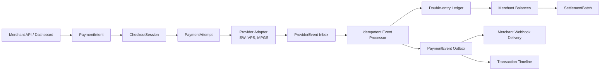
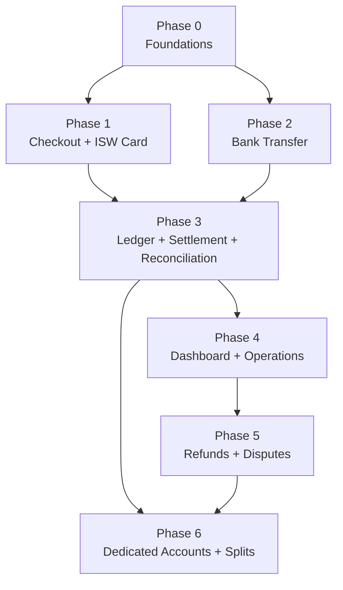
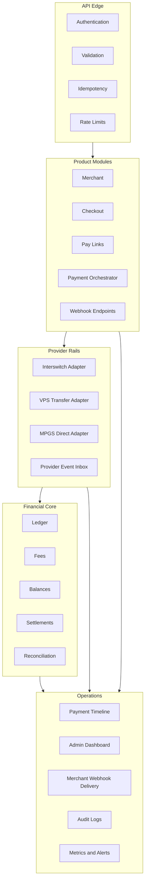

# Payment Gateway Implementation Phases

This folder breaks the Nigeria payment gateway build into connected, self-contained phases. Each phase is intentionally useful on its own, but it also hands a tested slice of the system to the next phase. The final product is the fusion of all slices into one payment gateway with one internal source of truth.

The source blueprint is `docs/nigeria_payment_gateway_blueprint.docx`. The current `gateway-baseline` app is treated as a learning source, not the target implementation. The baseline already demonstrates merchant keys, collection options, pay links, Interswitch card flows, MPGS hosted checkout, VPS virtual accounts, webhooks, queues, and exports. The target architecture keeps the good product lessons while rebuilding the financial core around intent, attempt, event, ledger, and settlement boundaries.

## North Star

Every rail-specific signal must collapse into one internal truth:

Provider payloads are evidence. They are not the system of record.

## Phase Map

| Phase | Document | Primary outcome | Hands off to |
| --- | --- | --- | --- |
| 0 | [Foundations](./00-foundations.md) | Canonical model, auth, idempotency, provider credential references, event inbox/outbox, adapter contracts, audit spine | Card and transfer rails |
| 1 | [Checkout and ISW Card](./01-checkout-isw-card.md) | Hosted checkout and local-card collection through Interswitch, including OTP/3DS actions, verify, provider events, and merchant webhooks | Bank transfer and shared payment lifecycle |
| 2 | [Bank Transfer](./02-bank-transfer.md) | Dynamic virtual-account checkout, VPS webhook ingestion, transfer matching, exception handling | Ledger, settlement, reconciliation |
| 3 | [Ledger, Settlement, Reconciliation](./03-ledger-settlement-reconciliation.md) | Double-entry financial truth, balances, settlement batches, statements, provider reconciliation | Dashboards and operations |
| 4 | [Dashboard and Operations](./04-dashboard-operations.md) | Merchant dashboard, admin cockpit, transaction timeline, webhook logs, replay, exports, runbooks | Refunds and disputes |
| 5 | [Refunds and Disputes](./05-refunds-disputes.md) | Refund resources, ledger reversals, provider refund paths, dispute evidence and workbench | Dedicated accounts and splits |
| 6 | [Dedicated Accounts and Splits](./06-dedicated-accounts-splits.md) | Dedicated virtual accounts, subaccounts, split allocation, split settlement | Product expansion |

## Dependency Graph

## How To Use These Documents

Each phase file has the same implementation contract:

| Section | Purpose |
| --- | --- |
| Whole-system fit | Shows why the phase exists and how it connects to the full gateway. |
| Build slice | Defines exactly what this phase builds and what it leaves out. |
| Baseline inputs | Names current code patterns worth learning from. |
| Target objects | Lists the tables, resources, services, and events the phase owns. |
| Flow diagrams | Visualizes the critical user, provider, and internal state transitions. |
| Implementation workplan | Breaks the build into coherent work packages. |
| API and event contract | Describes the external and internal contracts that must stabilize. |
| Tests and acceptance | Defines the gate that lets the next phase start safely. |
| Handoff | Makes explicit what the next phase can rely on. |

## Product Boundary

| In scope for the unified whole | Out of scope for first launch |
| --- | --- |
| Nigeria-only, NGN-first collections | Broad multi-currency product |
| Local card through Interswitch | Many-card-processor routing |
| Bank transfer through VPS-style virtual accounts | Open-ended bank-account aggregation |
| Platform-owned provider credentials | Bring-your-own merchant provider credentials |
| Payment intents, attempts, events, ledger, settlements | Single transaction row as financial truth |
| Hosted checkout, pay links, verify endpoint, signed webhooks | Merchant-only client-side trust model |
| Manual/admin controls for risk, refunds, disputes, holds | Fully automated risk/chargeback system |

## Core Decisions That All Phases Must Preserve

| Decision | Reason |
| --- | --- |
| Store money in minor units, such as kobo integers | Prevent rounding drift and settlement errors. |
| Use platform-owned provider credentials | Shared collection resources require internal attribution and reconciliation. |
| Persist provider events before mutating payment state | Enables replay, duplicate protection, auditability, and incident recovery. |
| Use idempotency for merchant writes and provider events | Prevents duplicate intents, charges, ledger postings, and webhooks. |
| Keep provider-specific state inside adapters | Prevents ISW, VPS, or MPGS quirks from leaking into core payment status. |
| Use a double-entry ledger for balances | Transaction status is not a balance and cannot power settlements safely. |
| Sign merchant webhooks with timestamp and event id | Reduces replay risk and supports reliable merchant fulfillment. |
| Treat browser callbacks as hints | Final payment state must come from provider verification, trusted webhook, or reconciliation. |

## Whole-System Module View

## Final Acceptance Criteria

The full build is complete when:

- A merchant can create test and live API keys.
- A merchant can initialize a payment and receive checkout data.
- A payer can complete an Interswitch card payment and a bank-transfer payment.
- The merchant can verify by reference.
- The merchant can receive a signed `payment.succeeded` webhook.
- Duplicate merchant requests cannot create duplicate charges.
- Duplicate provider events cannot double-post the ledger.
- Every successful payment produces balanced ledger entries.
- Merchant balances and settlement batches are derived from the ledger.
- Transfer and local-card funds follow T+1 settlement eligibility.
- International-card funds can follow up to T+7 eligibility when MPGS is enabled.
- Operators can inspect a payment timeline without raw database access.
- Finance can reconcile provider totals against internal ledger totals.
- Security and compliance sign off on API keys, provider secrets, card data, PII, webhooks, KYB, and audit controls.
